<div align="center">

<h1>
  <picture>
    <source media="(prefers-color-scheme: dark)" srcset="docs/brand/payneat-erp-logo-dark.svg">
    
  </picture>
</h1>

**Open-source supply-side ERP for a restaurant chain that runs its own supply chain —
from supplier to plant to branch to plate, with every lot traceable.**

**English** · [ภาษาไทย](./README.th.md)

[](./LICENSE)

[](https://suruchboss.github.io/PaynEat-ERP/)

**[Open the public demo](https://suruchboss.github.io/PaynEat-ERP/)**: the real console on the fictional chain's data, running
entirely in your browser. No server, nothing kept, and a real installation is still `docker compose`.

**[See what it solves](https://suruchboss.github.io/PaynEat-ERP/about/)**: the product page, problem by problem, with
screens from the demo.

</div>

---

> **Status: walking skeleton.** The domain model and architecture are decided and recorded as
> [ADRs](docs/adr/README.md). The backend runs — health, structured logs and metrics — and so does
> the web console, in Thai and English, with sign-in (a second factor for administrators), users,
> the seven roles, an audit trail, and the master data: items, units, purchase units with exact
> conversion factors, locations (plants, warehouses and branches, each plant and warehouse with its
> own in-transit location), suppliers, and the versioned master data change log a POS will pull
> from — and the **stock ledger**: lots, ledger entries nothing can change, opening balances that post
> in one transaction and are corrected only by reversal, and stock on hand as of any date, with its
> value. The console works on a desktop, a tablet (the menu narrows to icons) and a phone (each table
> row becomes a card), in light and dark mode, and anyone can try it in the browser on the
[public demo](https://suruchboss.github.io/PaynEat-ERP/). No purchasing, production or transfer document exists
> yet; they are being built in public, one GitHub issue at a time. This README says only what is true
> today and will grow as things work.

<!-- problems:start -->
<!-- Generated by docs/landing/build.mjs from docs/landing/content.mjs (#45). Edit those, not this section. -->

## The problems it solves today

What works on `main` today, grouped by the problem it solves for a chain. Every picture is the real console on the [public demo](https://suruchboss.github.io/PaynEat-ERP/); the same story, laid out as a page, is on the [product page](https://suruchboss.github.io/PaynEat-ERP/about/).

### Stock numbers everyone believes.

<p align="center">
  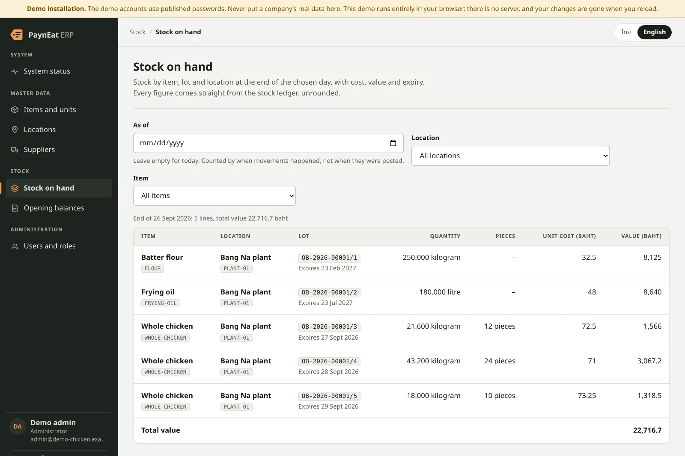
</p>

**The problem:** Spreadsheets get overwritten, the plant and the branches never agree, and nobody can say what the stock was last Tuesday.

Every movement is a ledger entry that nothing can change — the database itself refuses. A mistake is corrected by a reversal that stays next to the original. Stock on hand is read as of any business date, with the cost and value of every lot, in exact decimals.

- **Append-only** — Ledger entries are never updated or deleted.
- **As of any date** — Counted by when a movement happened, not when it was typed.
- **Exact** — Decimals, never floating point: 22,716.7 baht means 22,716.7.

**Try it:** Open “Stock on hand” and set “As of” to two days ago.

### Go live without the spreadsheet chaos.

<p align="center">
  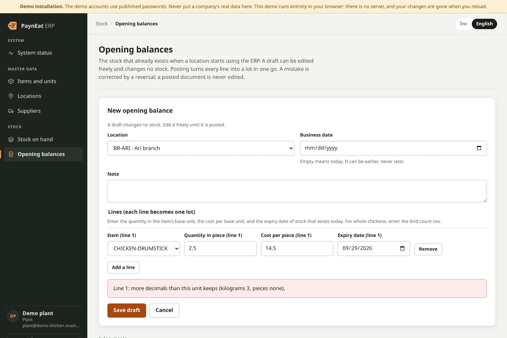
  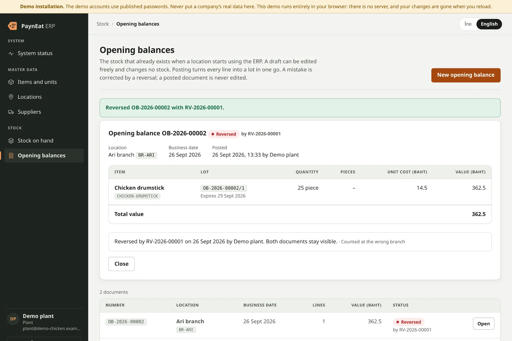
</p>

**The problem:** The first day on a new system is when bad data gets in: half a drumstick, a lot that has already expired, a number typed twice.

An opening balance is a draft until you post it, and it is checked line by line first. Posting turns every line into a lot in one transaction — or nothing at all. A posted document is final; a reversal, with its reason, is the only way back.

- **Checked per line** — Pieces have no decimals; an expired lot is refused.
- **All or nothing** — Every line becomes a lot in one transaction.
- **Traceable from day one** — OB-2026-00002, and its lots /1, /2.

**Try it:** Sign in as plant, press “New opening balance” and enter 2.5 drumsticks.

### One set of master data. Every branch, every system.

<p align="center">
  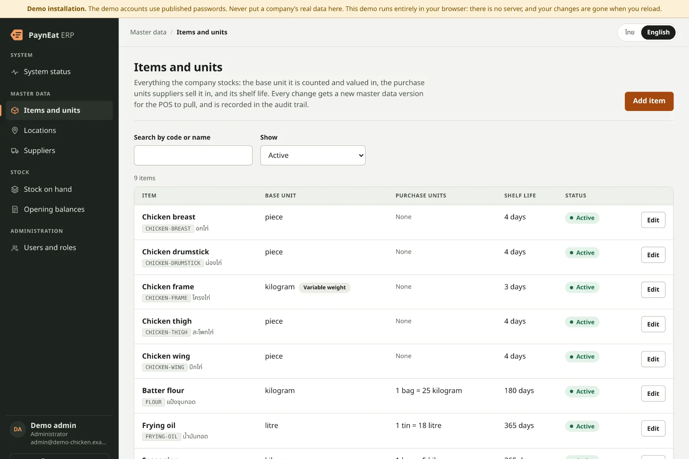
  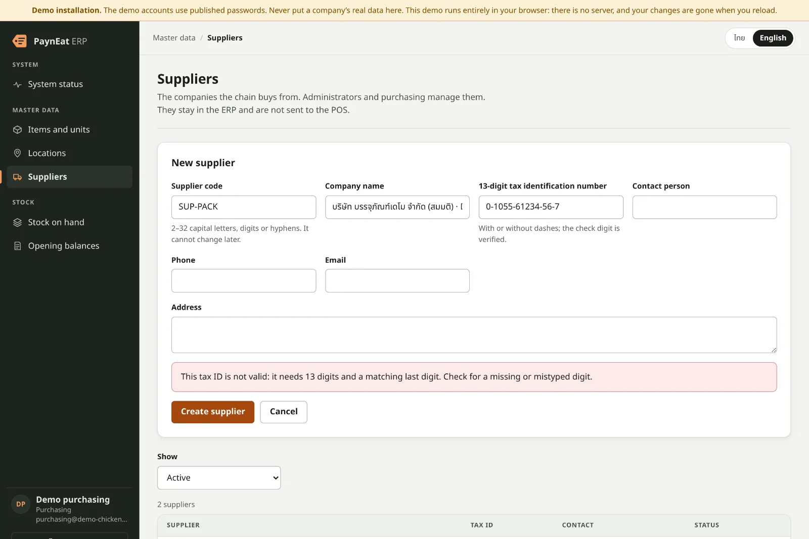
</p>

**The problem:** Each branch names the same chicken differently, suppliers sell by the bag, the kitchen counts by the piece, and the POS keeps its own list.

An item has one base unit and exact purchase units — 1 bag = 25 kilograms — and a whole chicken is kept by weight and by the bird. Location codes are shared with PaynEat POS and Cwork and fixed once used; every change is a numbered master data version a POS pulls. A supplier’s tax ID is checked by its check digit.

- **Units that convert exactly** — A factor is always above zero; a base unit never changes.
- **Versioned for the POS** — Every change is the next version, in order, with no gaps.
- **Caught at entry** — A mistyped Thai tax ID fails its check digit.

**Try it:** Sign in as purchasing, press “Add supplier” and mistype one digit of the tax ID.

### The right people. Only the right people.

<p align="center">
  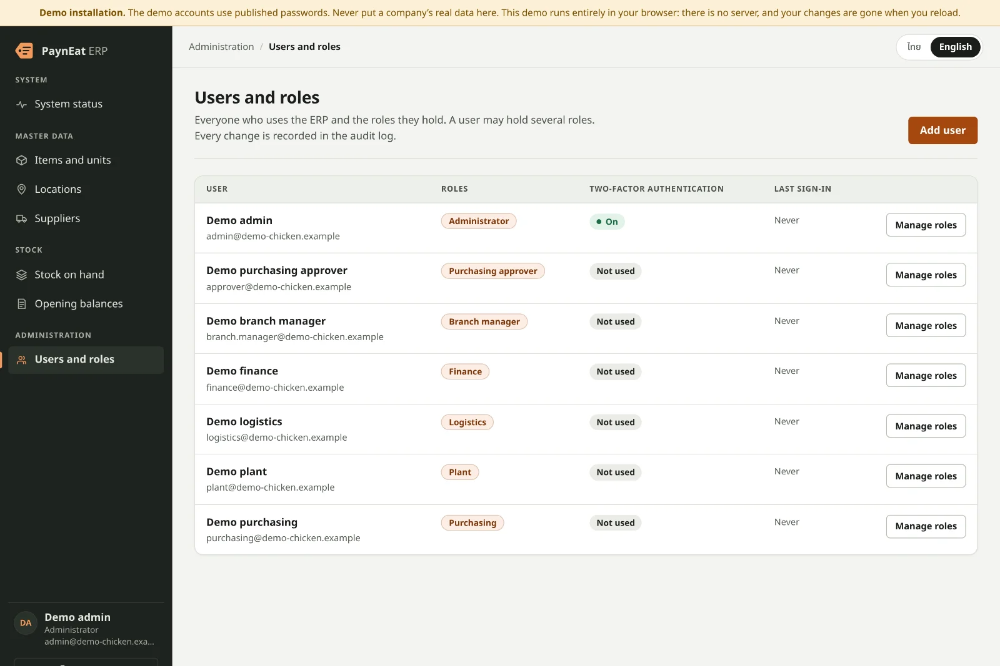
  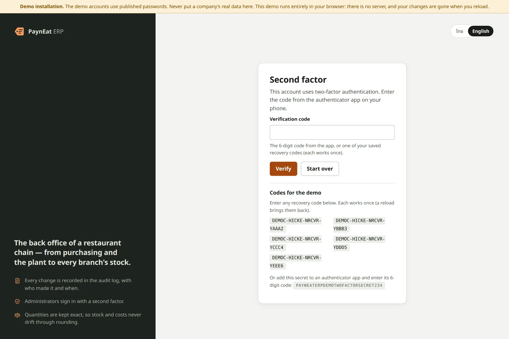
</p>

**The problem:** Everyone shares one login, anyone can change anything, and when something goes wrong there is no record of who did it.

Seven roles, enforced by the API — not just hidden buttons. Administrators sign in with a second factor and single-use recovery codes; five wrong tries lock an account for 15 minutes; the last administrator keeps the role. Every change and every refused sign-in lands in an append-only audit trail, with who, when and the request’s correlation id.

- **Seven roles** — From purchasing to finance; a user may hold several.
- **Second factor** — An authenticator code for administrators, with recovery codes.
- **Segregation of duties** — Nobody approves their own document — arriving with the first approval. _(Planned: [#8](https://github.com/SuruchBoss/PaynEat-ERP/issues/8))_

**Try it:** Sign in as admin with one of the recovery codes the sign-in screen shows, then open “Users and roles”.

### When something breaks, you’ll know why.

<p align="center">
  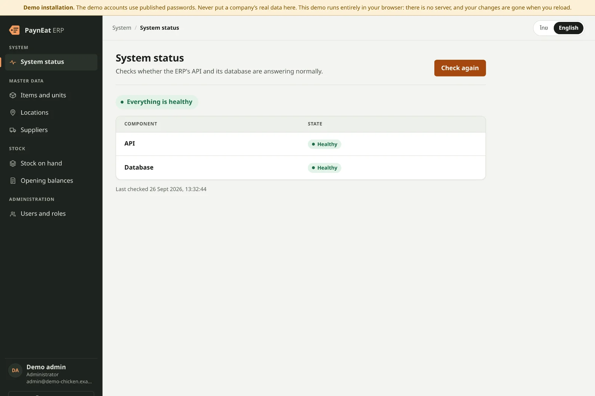
</p>

**The problem:** “The system is slow” — and nobody can find the one request that failed.

The console asks the API and its database whether they are healthy and, when one is not, shows the correlation id of that check — the same id as the API’s log line. Every request is one structured JSON log line under the ecosystem’s telemetry contract, and Prometheus metrics count requests, refused sign-ins and postings. Emails, passwords and codes never reach a log.

- **Health at a glance** — The API and its database, checked on demand.
- **One id, end to end** — The id on the screen is the id in the log.
- **Metrics built in** — Requests, refused sign-ins, postings by document type.

**Try it:** Open “System status”. On a Docker install, stop the database and press “Check again”.

### At the desk, on a tablet, in your pocket.

<p align="center">
  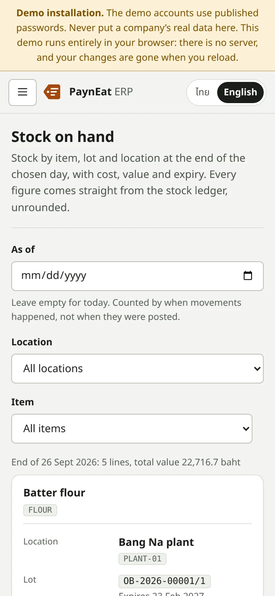
  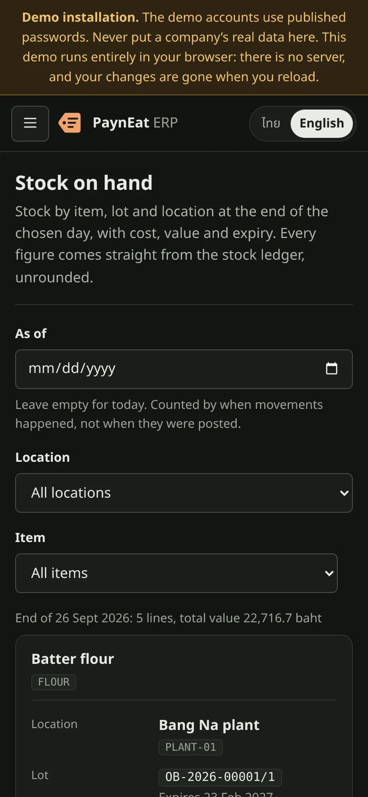
</p>

**The problem:** Branch managers are on the floor, not at a desk — and not everyone reads English.

The console fits a desktop, narrows its menu to icons on a tablet and turns every table row into a card on a phone, in light or dark mode, in Thai or English. You can try all of it now: the public demo runs the backend’s own rules in your browser, with no server.

- **One console** — Desktop, tablet and phone.
- **Light and dark** — Follows the device.
- **Thai and English** — One click, remembered by the browser.

**Try it:** Open the demo on your phone.

<!-- problems:end -->

## What this is

A mass-market restaurant chain does far more than sell food at a till. It buys raw materials from
several suppliers, processes them in its own plant — whole birds into portioned pieces, for
example — ships the output to its branches, and only then sells it. PaynEat ERP covers that
middle:

| | |
|---|---|
| **Procurement** | Suppliers, purchase orders, goods receipts with inspection, returns |
| **Production** | Production orders that turn input lots into output lots, with measured yield and cost allocation across co-products |
| **Distribution** | Branch requisitions, transfers through in-transit, inspected receipts at both ends |
| **Branch consumption** | Sales from [PaynEat POS](https://github.com/SuruchBoss/PaynEat) become theoretical usage through versioned recipes |
| **Control** | Append-only stock ledger, stock counts, period close, recalls, segregation of duties |
| **Planning** | Reorder points, par-based requisitions, and MRP-lite suggestions |

## The path the first release must walk exactly

Everything in the first release serves one end-to-end path through a fictional fried-chicken chain
(one plant, three branches, two suppliers):

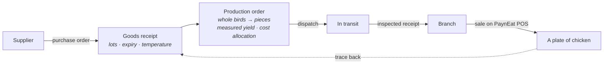

The last arrow is the point: from a dish sold at a branch, show every supplier lot it could have
come from — and be honest that branch-level allocation is inferred, not scanned
([ADR-0006](docs/adr/0006-lots-expiry-and-traceability.md)).

## Design decisions

The "why" matters more than the "what" in an ERP, so every decision is written down:

| ADR | Decision |
|---|---|
| [0001](docs/adr/0001-product-scope.md) | Product scope, and what lives elsewhere (GL export, HR and payroll in Cwork) |
| [0002](docs/adr/0002-system-boundaries-and-pos-integration.md) | Separate systems; ERP owns master data; POS sales flow through an outbox with idempotency keys |
| [0003](docs/adr/0003-append-only-stock-ledger.md) | Inventory is an append-only ledger of posted, immutable documents |
| [0004](docs/adr/0004-lot-costing-and-cost-allocation.md) | Actual cost per lot, FEFO consumption, co-product cost allocation |
| [0005](docs/adr/0005-units-and-variable-weight-items.md) | One base unit per item; variable-weight items record weight and count |
| [0006](docs/adr/0006-lots-expiry-and-traceability.md) | Lot genealogy, expiry blocking, recalls that report candidate lots |
| [0007](docs/adr/0007-receiving-inspection-and-transfers.md) | One inspection model; transfers through in-transit; no silent differences |
| [0008](docs/adr/0008-roles-and-segregation-of-duties.md) | Seven roles; nobody approves their own document |
| [0009](docs/adr/0009-replenishment-planning-v1.md) | Reorder points, requisitions and MRP-lite — suggestions, not automation |
| [0010](docs/adr/0010-backend-and-web-stack.md) | NestJS + Prisma + PostgreSQL, raw SQL for ledger posting, React console — aligned with Cwork |
| [0011](docs/adr/0011-ecosystem-and-sherwhyve.md) | One ecosystem with the POS, Cwork and SherWhyve; every system observable; a future variance investigator |
| [0012](docs/adr/0012-positioning-niche-depth-over-breadth.md) | Positioning: the best open-source option for Thai restaurant chains running their own supply chain — depth in one field, not a general ERP; integrate with existing accounting instead of replacing it |
| [0013](docs/adr/0013-extension-by-integration.md) | Extension by integration: a versioned public API, scoped tokens and signed webhooks — no in-process plugins that could bypass the ledger |
| [0014](docs/adr/0014-lot-expiry-never-later-than-supplier-date.md) | A lot's expiry is the earlier of shelf life and the supplier's date; production outputs never outlive their inputs |
| [0015](docs/adr/0015-editions-community-and-enterprise.md) | Two editions: a free Community edition that is complete for one chain, and a paid Enterprise edition for scale, regulation and AI; food safety, data access and upgrades are never paywalled |
| [0016](docs/adr/0016-exceltogo-spreadsheet-companion.md) | ExcelToGo joins as the spreadsheet companion: onboarding by template file, finance reports through the public API |
| [0017](docs/adr/0017-stock-counts.md) | Stock counts are blind and compared as of a count time; plants count per lot, branches per item, and a branch difference is allocated to lots by a rule you can check by hand |
| [0018](docs/adr/0018-period-close-and-business-time.md) | Periods close by business date per location; a sale that arrives after its period closed still posts, on the first open day and marked late; reopening is audited and re-exports are revisions |
| [0019](docs/adr/0019-exact-quantities-and-conversion-rounding.md) | Quantities and factors are exact decimals, never floating point; a factor is always above zero; converting to the base unit rounds once, half away from zero, to that unit's decimals; an item's base unit never changes |
| [0020](docs/adr/0020-distribution-and-installation.md) | The console installs from the browser on phones, tablets and PCs (v1, caches no data); after v1 a chain installs the server without a developer (first-run setup, one-command installer, backups and upgrades from the console); PaynEat Cloud hosting after the pilot; self-hosting always supported |
| [0021](docs/adr/0021-public-demo-in-the-browser.md) | A public demo of the console on GitHub Pages, answered inside the browser by the backend's own rules and demo data, never a copy of them; a screen the demo does not serve says so; a normal build carries none of it |

Domain vocabulary, in English and Thai: [`docs/GLOSSARY.md`](docs/GLOSSARY.md).

## How it fits with its companion projects

| Project | Owns |
|---|---|
| **PaynEat ERP** (this repository) | Items, recipes, suppliers, locations, stock, lots, cost, planning |
| [PaynEat POS](https://github.com/SuruchBoss/PaynEat) | Orders, payments, shifts, tax invoices at the branch — and still works on its own without the ERP |
| [Cwork](https://github.com/SuruchBoss/Cwork) | People, attendance, leave, payroll (integration planned) |
| SherWhyve *(private)* | AI investigator of technical incidents; reads the ERP's structured logs and metrics to explain, with evidence, why something broke |
| [ExcelToGo](https://github.com/SuruchBoss/ExcelToGo) | Spreadsheets: filling the ERP's import templates, and finance reports refreshed from the ERP's public API (planned, ADR-0016) |

The boundaries between them are in [ADR-0011](docs/adr/0011-ecosystem-and-sherwhyve.md): each owns one domain, they integrate only through versioned APIs and events, and a location has the same code in all of them.

## Roadmap for the first release (six weeks)

1. Integration contract with the POS, and the domain core: items, units, locations, lots, ledger
2. Purchase orders, goods receipts, production orders
3. Transfers and requisitions
4. POS side: outbox, connected mode, read-only master data (in the POS repository)
5. Traceability and recall, stock counts, period close
6. Quality: tests, demo data, documentation, a walkthrough video, and a console that installs from the
   browser on phones, tablets and PCs

After the first release, in order: a branch stock-balance feed to the POS; installing the server
without a developer (first-run setup in the console, a one-command installer, backups and upgrades from
the console, [ADR-0020](docs/adr/0020-distribution-and-installation.md)); import templates for moving a
chain's data in; a versioned public API, scoped API tokens and outbound webhooks, so chains can build
their own add-ons as separate services ([ADR-0013](docs/adr/0013-extension-by-integration.md)); then a
pilot chain, and PaynEat Cloud hosting for chains without IT staff.

Progress is tracked in [GitHub Issues](https://github.com/SuruchBoss/PaynEat-ERP/issues).

## Editions

| | Community | Enterprise |
|---|---|---|
| Price | Free | Paid, per active location per month (never per user) |
| License | Apache 2.0 | Elastic License 2.0 (source available in `ee/`) |
| What | Everything in the first release and every later improvement to the supplier-to-plate path, with no limits on users, locations or data | Needs that grow with scale, regulation or running cost: several companies and plants, a food-safety programme (HACCP, sensors, mock recalls), pack scanning, finance depth, a mobile app, accounting connectors, AI agents, single sign-on |
| Status | Being built now | Starts after the first release, with a pilot chain |

**Never behind a paywall:** food safety and data integrity (expiry blocking, recall tracing, the
ledger, segregation of duties, the audit trail), basic security, full access to your own data, and
the documented upgrade path. A Community feature is never moved to Enterprise. Hosting, managed
upgrades, support and implementation are offered as paid services for either edition. Details:
[ADR-0015](docs/adr/0015-editions-community-and-enterprise.md).

## Try it

What works today: signing in, with a second factor for administrators; users and the seven roles
of [ADR-0008](docs/adr/0008-roles-and-segregation-of-duties.md); an append-only audit trail; the
**master data** — items, units and purchase units; locations, whose codes are shared with the POS
and Cwork; suppliers — each change to an item or a branch a new master data version a POS can pull;
the **stock ledger** — opening balances and stock on hand by item, lot and location, as of any date;
and the skeleton under them — an API that reports its own health and its database's, writes every request as
structured JSON (the ecosystem's [telemetry contract](docs/TELEMETRY.md)) and counts requests,
failed sign-ins and postings in Prometheus metrics.

### In your browser, with nothing to install

Open **https://suruchboss.github.io/PaynEat-ERP/**. It is this console, built with an in-browser demo API in place of a server
([ADR-0021](docs/adr/0021-public-demo-in-the-browser.md)). It holds the fictional chain and the demo
accounts below, and it refuses what the API refuses, because it runs the backend's own rules. What you
change lives in your browser for that visit, and a reload starts again. The sign-in screen lists the
accounts and the admin's codes. Every screen in the tour below is there. A screen added later says
when it is not in the demo yet. For the API itself, its logs and metrics, or your own data, install it:

### On your machine, with Docker

You need [Docker](https://docs.docker.com/get-docker/) and, for the first step, `openssl`.

```bash
# Three secrets of your own, which compose refuses to start without (see .env.example)
printf 'JWT_ACCESS_SECRET=%s\nJWT_REFRESH_SECRET=%s\nFIELD_ENCRYPTION_KEY=%s\n' \
  "$(openssl rand -base64 48)" "$(openssl rand -base64 48)" "$(openssl rand -base64 32)" > .env
# On purpose: this is an evaluation with the demo chain, whose passwords are published
echo 'ERP_DEMO=1' >> .env

docker compose up -d --build                        # PostgreSQL 16, the API and the web console
docker compose run --rm --build migrate             # apply database migrations
docker compose run --rm migrate npm run db:seed     # the fictional chain: users, items, sites, suppliers, opening stock
curl http://localhost:3100/health                   # {"status":"ok","api":"up","database":"up"}
docker compose logs api                             # one JSON object per line
```

Then open **http://localhost:8180** and sign in with one of the demo accounts below. The console
opens in Thai; **English** is one click away, top right, and the browser remembers the choice.

### A demo installation, on purpose (`ERP_DEMO=1`)

The demo accounts' passwords are in this README, so they only ever work where you asked for them:

- **The seed refuses to run** without `ERP_DEMO=1`, and never under `NODE_ENV=production`.
- **The API refuses their sign-in** without `ERP_DEMO=1` (a refused sign-in like any other), and ends
  any session one of them already holds.
- **A production API refuses to start** while any demo account is enabled and `ERP_DEMO=1` is not
  set. Its last log line is a `CRITICAL` one saying how to fix it: disable them with
  `docker compose run --rm migrate npm run demo:disable` (users are never deleted, only disabled),
  or set `ERP_DEMO=1` if this really is an evaluation. Running the seed again turns them back on.
- **With `ERP_DEMO=1`**, the API says so in a `WARNING` line at every start, and every console
  screen, the sign-in screen included, carries a **demo installation** banner that cannot be closed.

Demo accounts are the ones the seed marked as such, never recognised by their email. `.env.example`
has the line commented out: a real installation never sets it.

### Demo accounts

> **Evaluation only.** Every credential here is published in this repository and restored each time
> the seed runs. Never use them, or the seed, for a real installation.

The password of every demo account is **`demo-chicken-2026`**.

| Role | Email | What the role is for (ADR-0008) | What it can do in the console today |
|---|---|---|---|
| `admin` | `admin@demo-chicken.example` | Manage users, roles, locations, configuration; reopen closed periods | Sign in with a second factor; **Users and roles**: list, create, give and take away roles; **Items and units**: create, edit, deactivate; **Locations**: create, correct a code, deactivate, supersede; **Suppliers**; read stock on hand and opening balances; read the audit trail (API) |
| `purchasing` | `purchasing@demo-chicken.example` | Create and send purchase orders; manage suppliers | Sign in; **Suppliers**: create, edit, deactivate; read items, locations and stock on hand; its purchase-order screens arrive with #10 |
| `purchasing_approver` | `approver@demo-chicken.example` | Approve purchase orders above the approval threshold | Sign in; read items, locations, suppliers and stock on hand; its screen arrives with #10 |
| `plant` | `plant@demo-chicken.example` | Receive goods, run production orders, manage plant stock | Sign in; **Opening balances**: draft, post, reverse; **Stock on hand**; read items, locations and suppliers; its receipt and production screens arrive with #11 and #13 |
| `logistics` | `logistics@demo-chicken.example` | Dispatch transfers | Sign in; read items, locations, suppliers and stock on hand; its screen arrives with #14 |
| `branch_manager` | `branch.manager@demo-chicken.example` | Raise requisitions, receive transfers, count branch stock | Sign in; read items, locations, suppliers and stock on hand; its screens arrive with #14 and #15 |
| `finance` | `finance@demo-chicken.example` | View costs, variances and valuation; export financial data | Sign in; **Stock on hand** with cost and value; read items, locations and suppliers; its screens arrive with the costing and period-close work of weeks 4–5 |

A user may hold several roles; the API refuses anything none of them allows (403), and anything
without a session (401). Nobody approves a document they created, whatever roles they hold — that
check arrives with the first approval (#8, #10).

**The admin account needs a second factor.** Add the published demo secret to any authenticator app
(Google Authenticator, Microsoft Authenticator, 1Password, …) and type the 6-digit code it shows:

- secret **`PAYNEATERPDEMOTWOFACTORSECRET234`**, or this URI as a QR code:
  `otpauth://totp/PaynEat%20ERP%3Aadmin%40demo-chicken.example?secret=PAYNEATERPDEMOTWOFACTORSECRET234&issuer=PaynEat%20ERP&algorithm=SHA1&digits=6&period=30`
- no authenticator at hand? These recovery codes work in place of a code, each once (the seed
  restores them): `DEMOC-HICKE-NRCVR-YAAA2`, `DEMOC-HICKE-NRCVR-YBBB3`, `DEMOC-HICKE-NRCVR-YCCC4`,
  `DEMOC-HICKE-NRCVR-YDDD5`, `DEMOC-HICKE-NRCVR-YEEE6`.

### A five-minute tour

Every step works on the [public demo](https://suruchboss.github.io/PaynEat-ERP/) as well as on a Docker install; on the demo, a reload
undoes them.

1. Sign in as **admin**: password, then the code. A wrong code counts like a wrong password — five in
   a row lock the account for 15 minutes.
2. Open **Users and roles**. **Add user**: give a name, an email, a first password (at least 12
   characters) and tick **Administrator**.
3. **Sign out** and sign in as that new user. An administrator without a second factor has to set
   one up before anything else: scan the QR code, type a code, and keep the recovery codes the
   console shows once.
4. Back as **admin**, **Manage roles** on any user: each tick gives a role, each untick takes it away,
   effective on that user's next request. Take **Administrator** from the user you created, then
   from yourself: the last active administrator keeps the role, and the console says why.
5. Sign in as **purchasing**: no **Users and roles** in the menu, and `/users` says you cannot open it.
   **Items and units** is there, read-only: whole chicken in kg (variable weight, bought by the case,
   `1 case = 20 kg`), the four cuts in pieces, the frame in kg, batter flour, frying oil and seasoning.
6. Back as **admin**, open **Items and units** and **Add item**: a code (typed in any case, stored in
   capitals), Thai and English names, a base unit, a shelf life, and a purchase unit, say a **bag** of
   `25` kg — the form previews `1 bag = 25 kilograms`. Now try a factor of `0`, `-5` or the base unit
   itself as a purchase unit: the API refuses, and each row says why. **Edit** an item: its code and
   base unit cannot change (ADR-0019). **Deactivate** it: it leaves the default list, nothing is
   deleted, and **Show: All** brings it back to reactivate.
7. Every item change is a new **master data version**, the number a POS pulls by. Read the log with
   any user's access token: `GET /api/v1/master-data/changes?since=0` returns each change in version
   order, the whole item as it stood after it, and `latestVersion`; ask again with `since` set to the
   last version you saw and only newer changes come back. Two admins saving at the same moment still
   get consecutive versions, and the one who saved from a stale screen is told to reload rather than
   silently undoing the other.
8. Open **Locations**: the Bang Na plant `PLANT-01`, its in-transit location `IN-TRANSIT:PLANT-01`
   (made by the system, not editable), and three branches. **Add location**: a warehouse `wh-01`
   (stored as `WH-01`) gets its own `IN-TRANSIT:WH-01` at once. Try a code with a space or in Thai:
   refused, with the rule. **Edit** a branch and correct its code: allowed, because no document has
   used it yet — it arrives in `GET /api/v1/master-data/changes` like an item. Once a posted document
   or a POS pull uses a code (from #8), it is fixed; a wrong code in use is fixed by creating the right
   branch and **Supersede by another location** on the old one, which deactivates it with a link the
   POS receives. Every request about a location logs `"location_code"` on its line.
9. Sign in as **purchasing**: **Suppliers** can be added and edited here (the only thing this role
   changes so far). The tax identification number takes dashes or not, and a mistyped digit is caught
   by its check digit. Suppliers stay in the ERP and never reach a POS.
10. Open **Stock on hand** (any account): the plant's opening stock — batter flour, frying oil, and
   three lots of whole chicken, each weighed with its bird count and expiring on a different day — with
   the unit cost and value of every lot, 22,716.7 baht in all. Every figure is the ledger's exact
   decimal, never rounded. Set **As of** to two days ago: nothing, because the opening balance is dated
   yesterday. Stock as of a date is counted by when a movement happened (its business date), not when
   it was posted (ADR-0018).
11. Sign in as **plant**, open **Opening balances** and **New opening balance** at a branch: a line of
   whole chicken (kilograms and birds) and a line of drumsticks. `2.5` drumsticks is refused on its
   line — pieces have no decimals (ADR-0019). **Save draft**: it is numbered at once (`OB-2026-00002`)
   and still changes no stock. **Post this document**: each line becomes a lot (`OB-2026-00002/1`,
   `/2`) in one transaction, or nothing does. A posted document cannot be edited: **Reverse this
   document**, with a reason, posts `RV-2026-00001`, which negates it exactly; both stay visible, the
   lots leave stock on hand, and a second reversal of the same document is refused even if two arrive
   at the same moment. A lot already expired on its business date is refused too. Every posting and
   every refusal is a `ledger.posting.succeeded` or `ledger.posting.refused` log line carrying the
   `document_number` (and the `rule` that refused it), counted in `erp_postings_total`.
12. Every one of those changes, and every refused sign-in, is in the audit trail with who, when and
   the request's correlation id. Read it through the API with the admin's access token:
   `GET /api/v1/audit-logs` (filters: `action`, `entityId`, `actorUserId`, `correlationId`, `from`,
   `to`). A refused sign-in is also a `WARNING` line with `"event":"auth.sign_in.failed"` in
   `docker compose logs api` — never with the email, password or code — and one more in the
   `auth_sign_in_failures_total` metric.

The **System status** screen (the home page) asks the API whether it and its database are healthy.
Stop the database (`docker compose stop postgres`) and press **Check again**: the database shows as
not healthy, with the **correlation ID** of that check, which is the same id on the API's log line
for it (`docker compose logs api | grep <id>`).

The console is on port **8180** and the API on **3100**, so both can run next to PaynEat POS, whose
Docker install uses 3000 and 8080. Metrics are served on port 9464 inside the compose network and
are deliberately not published. `docker compose down -v` removes everything, data included.

Ledger entries are never updated or deleted — the database itself refuses it. Stock on hand for today
is read from a balance snapshot every posting keeps up to date; the ledger wins on any disagreement,
and `docker compose run --rm migrate npm run ledger:rebuild-balances` rebuilds the snapshot from the
ledger, listing any balance that differed first.

To work on the backend itself (Node.js 22 and a PostgreSQL 16 you can reach):

```bash
cd backend
cp .env.example .env        # then point DATABASE_URL and E2E_DATABASE_URL at your PostgreSQL,
                            # set FIELD_ENCRYPTION_KEY (openssl rand -base64 32), and uncomment
                            # ERP_DEMO=1 to use the demo chain
npm ci
npx prisma migrate deploy && npm run db:seed
npm run start:dev           # http://localhost:3000/health
```

And the console (Node.js 22), which forwards `/api` and `/health` to that backend:

```bash
cd web
npm ci
npm run dev                 # http://localhost:5173 (VITE_API_PROXY_TARGET changes the backend address)
```

Every check CI runs is listed in [`CLAUDE.md`](CLAUDE.md#stack).

## Contributing

Issues labelled `ready-for-agent` are self-contained and can be picked up; claim one before you
start (see [`CLAUDE.md`](CLAUDE.md) for the working agreement, which applies to people as much as
to AI agents).

## License

Copyright 2026 Suruch Chakrapeesirisuk. Everything outside `ee/` is licensed under the
[Apache License 2.0](LICENSE). The `ee/` directory is licensed under the
[Elastic License 2.0](ee/LICENSE) and holds no code in v1 (ADR-0015). Every source file names its license
with an SPDX identifier, which CI checks. Pull requests from forks are signed off under the Developer
Certificate of Origin; see [CONTRIBUTING.md](CONTRIBUTING.md). If you build on this, keep the
[NOTICE](NOTICE).
