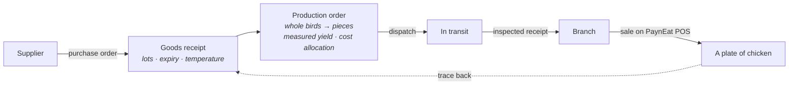

<div align="center">

# PaynEat ERP

**Open-source supply-side ERP for a restaurant chain that runs its own supply chain —
from supplier to plant to branch to plate, with every lot traceable.**

**English** · [ภาษาไทย](./README.th.md)

[](./LICENSE)


</div>

---

> **Status: walking skeleton.** The domain model and architecture are decided and recorded as
> [ADRs](docs/adr/README.md). The backend runs — health, structured logs and metrics — and so does
> the web console's shell, in Thai and English, but no business feature exists yet; they are being
> built in public, one GitHub issue at a time. This README says only what is true today and will
> grow as things work.

## What this is

A mass-market restaurant chain does far more than sell food at a till. It buys raw materials from
several suppliers, processes them in its own plant — whole birds into portioned pieces, for
example — ships the output to its branches, and only then sells it. PaynEat ERP covers that
middle:

| | |
|---|---|
| **Procurement** | Suppliers, purchase orders, goods receipts with inspection, returns |
| **Production** | Production orders that turn input lots into output lots, with measured yield and cost allocation across co-products |
| **Distribution** | Branch requisitions, transfers through in-transit, inspected receipts at both ends |
| **Branch consumption** | Sales from [PaynEat POS](https://github.com/SuruchBoss/PaynEat) become theoretical usage through versioned recipes |
| **Control** | Append-only stock ledger, stock counts, period close, recalls, segregation of duties |
| **Planning** | Reorder points, par-based requisitions, and MRP-lite suggestions |

## The path the first release must walk exactly

Everything in the first release serves one end-to-end path through a fictional fried-chicken chain
(one plant, three branches, two suppliers):



The last arrow is the point: from a dish sold at a branch, show every supplier lot it could have
come from — and be honest that branch-level allocation is inferred, not scanned
([ADR-0006](docs/adr/0006-lots-expiry-and-traceability.md)).

## Design decisions

The "why" matters more than the "what" in an ERP, so every decision is written down:

| ADR | Decision |
|---|---|
| [0001](docs/adr/0001-product-scope.md) | Product scope, and what lives elsewhere (GL export, HR and payroll in Cwork) |
| [0002](docs/adr/0002-system-boundaries-and-pos-integration.md) | Separate systems; ERP owns master data; POS sales flow through an outbox with idempotency keys |
| [0003](docs/adr/0003-append-only-stock-ledger.md) | Inventory is an append-only ledger of posted, immutable documents |
| [0004](docs/adr/0004-lot-costing-and-cost-allocation.md) | Actual cost per lot, FEFO consumption, co-product cost allocation |
| [0005](docs/adr/0005-units-and-variable-weight-items.md) | One base unit per item; variable-weight items record weight and count |
| [0006](docs/adr/0006-lots-expiry-and-traceability.md) | Lot genealogy, expiry blocking, recalls that report candidate lots |
| [0007](docs/adr/0007-receiving-inspection-and-transfers.md) | One inspection model; transfers through in-transit; no silent differences |
| [0008](docs/adr/0008-roles-and-segregation-of-duties.md) | Seven roles; nobody approves their own document |
| [0009](docs/adr/0009-replenishment-planning-v1.md) | Reorder points, requisitions and MRP-lite — suggestions, not automation |
| [0010](docs/adr/0010-backend-and-web-stack.md) | NestJS + Prisma + PostgreSQL, raw SQL for ledger posting, React console — aligned with Cwork |
| [0011](docs/adr/0011-ecosystem-and-sherwhyve.md) | One ecosystem with the POS, Cwork and SherWhyve; every system observable; a future variance investigator |
| [0012](docs/adr/0012-positioning-niche-depth-over-breadth.md) | Positioning: the best open-source option for Thai restaurant chains running their own supply chain — depth in one field, not a general ERP; integrate with existing accounting instead of replacing it |
| [0013](docs/adr/0013-extension-by-integration.md) | Extension by integration: a versioned public API, scoped tokens and signed webhooks — no in-process plugins that could bypass the ledger |
| [0014](docs/adr/0014-lot-expiry-never-later-than-supplier-date.md) | A lot's expiry is the earlier of shelf life and the supplier's date; production outputs never outlive their inputs |
| [0015](docs/adr/0015-editions-community-and-enterprise.md) | Two editions: a free Community edition that is complete for one chain, and a paid Enterprise edition for scale, regulation and AI; food safety, data access and upgrades are never paywalled |
| [0016](docs/adr/0016-exceltogo-spreadsheet-companion.md) | ExcelToGo joins as the spreadsheet companion: onboarding by template file, finance reports through the public API |

Domain vocabulary, in English and Thai: [`docs/GLOSSARY.md`](docs/GLOSSARY.md).

## How it fits with its companion projects

| Project | Owns |
|---|---|
| **PaynEat ERP** (this repository) | Items, recipes, suppliers, locations, stock, lots, cost, planning |
| [PaynEat POS](https://github.com/SuruchBoss/PaynEat) | Orders, payments, shifts, tax invoices at the branch — and still works on its own without the ERP |
| [Cwork](https://github.com/SuruchBoss/Cwork) | People, attendance, leave, payroll (integration planned) |
| SherWhyve *(private)* | AI investigator of technical incidents; reads the ERP's structured logs and metrics to explain, with evidence, why something broke |
| [ExcelToGo](https://github.com/SuruchBoss/ExcelToGo) | Spreadsheets: filling the ERP's import templates, and finance reports refreshed from the ERP's public API (planned, ADR-0016) |

The boundaries between them are in [ADR-0011](docs/adr/0011-ecosystem-and-sherwhyve.md): each owns one domain, they integrate only through versioned APIs and events, and a location has the same code in all of them.

## Roadmap for the first release (six weeks)

1. Integration contract with the POS, and the domain core: items, units, locations, lots, ledger
2. Purchase orders, goods receipts, production orders
3. Transfers and requisitions
4. POS side: outbox, connected mode, read-only master data (in the POS repository)
5. Traceability and recall, stock counts, period close
6. Quality: tests, demo data, documentation, a walkthrough video

After the first release: a versioned public API, scoped API tokens and outbound webhooks, so chains
can build their own add-ons as separate services ([ADR-0013](docs/adr/0013-extension-by-integration.md)).

Progress is tracked in [GitHub Issues](https://github.com/SuruchBoss/PaynEat-ERP/issues).

## Editions

| | Community | Enterprise |
|---|---|---|
| Price | Free | Paid, per active location per month (never per user) |
| License | Apache 2.0 | Elastic License 2.0 (source available in `ee/`) |
| What | Everything in the first release and every later improvement to the supplier-to-plate path, with no limits on users, locations or data | Needs that grow with scale, regulation or running cost: several companies and plants, a food-safety programme (HACCP, sensors, mock recalls), pack scanning, finance depth, a mobile app, accounting connectors, AI agents, single sign-on |
| Status | Being built now | Starts after the first release, with a pilot chain |

**Never behind a paywall:** food safety and data integrity (expiry blocking, recall tracing, the
ledger, segregation of duties, the audit trail), basic security, full access to your own data, and
the documented upgrade path. A Community feature is never moved to Enterprise. Hosting, managed
upgrades, support and implementation are offered as paid services for either edition. Details:
[ADR-0015](docs/adr/0015-editions-community-and-enterprise.md).

## Try it

What works today is the skeleton: an API that reports its own health and its database's, writes
every request as structured JSON (the ecosystem's [telemetry contract](docs/TELEMETRY.md)) and counts
requests in Prometheus metrics, and the web console every later screen will live in. You need
[Docker](https://docs.docker.com/get-docker/).

```bash
docker compose up -d --build                        # PostgreSQL 16, the API and the web console
docker compose run --rm --build migrate             # apply database migrations
docker compose run --rm migrate npm run db:seed     # the fictional fried-chicken chain (so far: the company)
curl http://localhost:3100/health                   # {"status":"ok","api":"up","database":"up"}
docker compose logs api                             # one JSON object per line
```

Then open **http://localhost:8180**: the console opens in Thai on its **System status** screen,
which asks the API whether it and its database are healthy. **English** is one click away, top
right, and the browser remembers the choice. Stop the database (`docker compose stop postgres`)
and press **Check again**: the database shows as not healthy, with the **correlation ID** of that
check, which is the same id on the API's log line for it (`docker compose logs api | grep <id>`).
Sign-in arrives with the next ticket; until then the console has nothing to protect.

The console is on port **8180** and the API on **3100**, so both can run next to PaynEat POS, whose
Docker install uses 3000 and 8080. Metrics are served on port 9464 inside the compose network and
are deliberately not published. `docker compose down -v` removes everything, data included.

To work on the backend itself (Node.js 22 and a PostgreSQL 16 you can reach):

```bash
cd backend
cp .env.example .env        # then point DATABASE_URL and E2E_DATABASE_URL at your PostgreSQL
npm ci
npx prisma migrate deploy && npm run db:seed
npm run start:dev           # http://localhost:3000/health
```

And the console (Node.js 22), which forwards `/api` and `/health` to that backend:

```bash
cd web
npm ci
npm run dev                 # http://localhost:5173 (VITE_API_PROXY_TARGET changes the backend address)
```

Every check CI runs is listed in [`CLAUDE.md`](CLAUDE.md#stack).

## Contributing

Issues labelled `ready-for-agent` are self-contained and can be picked up; claim one before you
start (see [`CLAUDE.md`](CLAUDE.md) for the working agreement, which applies to people as much as
to AI agents).

## License

[Apache License 2.0](LICENSE), except the `ee/` directory once it exists, which will carry its own
license (ADR-0015). If you build on this, keep the [NOTICE](NOTICE).
