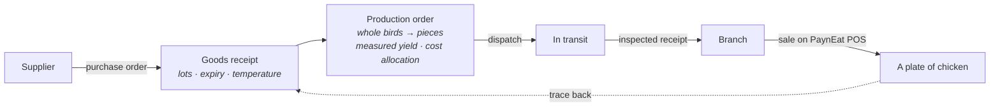

# PaynEat ERP

**Open-source supply-side ERP for a restaurant chain that runs its own supply chain —
from supplier to plant to branch to plate, with every lot traceable.**

**English** · [ภาษาไทย](./README.th.md)

---

> **Status: design phase.** The domain model and architecture are decided and recorded as
> [ADRs](docs/adr/README.md). No application code exists yet; it is being built in public, one
> GitHub issue at a time. This README says only what is true today and will grow as things work.

## What this is

A mass-market restaurant chain does far more than sell food at a till. It buys raw materials from
several suppliers, processes them in its own plant — whole birds into portioned pieces, for
example — ships the output to its branches, and only then sells it. PaynEat ERP covers that
middle:

| | |
|---|---|
| **Procurement** | Suppliers, purchase orders, goods receipts with inspection, returns |
| **Production** | Production orders that turn input lots into output lots, with measured yield and cost allocation across co-products |
| **Distribution** | Branch requisitions, transfers through in-transit, inspected receipts at both ends |
| **Branch consumption** | Sales from [PaynEat POS](https://github.com/SuruchBoss/PaynEat) become theoretical usage through versioned recipes |
| **Control** | Append-only stock ledger, stock counts, period close, recalls, segregation of duties |
| **Planning** | Reorder points, par-based requisitions, and MRP-lite suggestions |

## The path the first release must walk exactly

Everything in the first release serves one end-to-end path through a fictional fried-chicken chain
(one plant, three branches, two suppliers):

The last arrow is the point: from a dish sold at a branch, show every supplier lot it could have
come from — and be honest that branch-level allocation is inferred, not scanned
([ADR-0006](docs/adr/0006-lots-expiry-and-traceability.md)).

## Design decisions

The "why" matters more than the "what" in an ERP, so every decision is written down:

| ADR | Decision |
|---|---|
| [0001](docs/adr/0001-product-scope.md) | Product scope, and what lives elsewhere (GL export, HR and payroll in Cwork) |
| [0002](docs/adr/0002-system-boundaries-and-pos-integration.md) | Separate systems; ERP owns master data; POS sales flow through an outbox with idempotency keys |
| [0003](docs/adr/0003-append-only-stock-ledger.md) | Inventory is an append-only ledger of posted, immutable documents |
| [0004](docs/adr/0004-lot-costing-and-cost-allocation.md) | Actual cost per lot, FEFO consumption, co-product cost allocation |
| [0005](docs/adr/0005-units-and-variable-weight-items.md) | One base unit per item; variable-weight items record weight and count |
| [0006](docs/adr/0006-lots-expiry-and-traceability.md) | Lot genealogy, expiry blocking, recalls that report candidate lots |
| [0007](docs/adr/0007-receiving-inspection-and-transfers.md) | One inspection model; transfers through in-transit; no silent differences |
| [0008](docs/adr/0008-roles-and-segregation-of-duties.md) | Seven roles; nobody approves their own document |
| [0009](docs/adr/0009-replenishment-planning-v1.md) | Reorder points, requisitions and MRP-lite — suggestions, not automation |

| [0010](docs/adr/0010-backend-and-web-stack.md) | NestJS + Prisma + PostgreSQL, raw SQL for ledger posting, React console — aligned with Cwork |

Domain vocabulary, in English and Thai: [`docs/GLOSSARY.md`](docs/GLOSSARY.md).

## How it fits with its companion projects

| Project | Owns |
|---|---|
| **PaynEat ERP** (this repository) | Items, recipes, suppliers, locations, stock, lots, cost, planning |
| [PaynEat POS](https://github.com/SuruchBoss/PaynEat) | Orders, payments, shifts, tax invoices at the branch — and still works on its own without the ERP |
| [Cwork](https://github.com/SuruchBoss/Cwork) | People, attendance, leave, payroll (integration planned) |

## Roadmap for the first release (six weeks)

1. Integration contract with the POS, and the domain core: items, units, locations, lots, ledger
2. Purchase orders, goods receipts, production orders
3. Transfers and requisitions
4. POS side: outbox, connected mode, read-only master data (in the POS repository)
5. Traceability and recall, stock counts, period close
6. Quality: tests, demo data, documentation, a walkthrough video

Progress is tracked in [GitHub Issues](https://github.com/SuruchBoss/PaynEat-ERP/issues).

## Contributing

Issues labelled `ready-for-agent` are self-contained and can be picked up; claim one before you
start (see [`CLAUDE.md`](CLAUDE.md) for the working agreement, which applies to people as much as
to AI agents).

## License

[Apache License 2.0](LICENSE). If you build on this, keep the [NOTICE](NOTICE).
