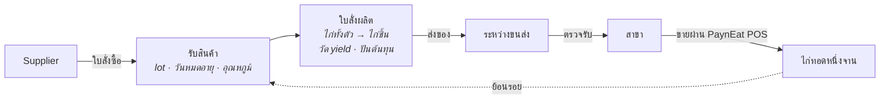

<div align="center">

# PaynEat ERP

**ERP ฝั่งซัพพลายแบบ open source สำหรับเชนร้านอาหารที่คุมห่วงโซ่อุปทานเอง —
ตั้งแต่ ซัพพลายเออร์ → โรงงาน → สาขา → จานบนโต๊ะลูกค้า และย้อนรอยได้ทุก lot**

[English](./README.md) · **ภาษาไทย**

[](./LICENSE)


</div>

---

> **สถานะ: โครงระบบ (walking skeleton)** โมเดลโดเมนและสถาปัตยกรรมตัดสินใจแล้ว บันทึกไว้เป็น
> [ADR](docs/adr/README.md) backend รันได้แล้ว (health, log แบบมีโครงสร้าง และ metric) พร้อมโครงของ
> web console ภาษาไทยและอังกฤษ แต่ยังไม่มีฟีเจอร์ทางธุรกิจ กำลังสร้างแบบเปิดเผยทีละ issue บน GitHub
> README นี้บอกเฉพาะสิ่งที่จริง ณ วันนี้ และจะเพิ่มขึ้นเมื่อแต่ละส่วนใช้งานได้จริง

## นี่คืออะไร

เชนร้านอาหารขนาดใหญ่ไม่ได้แค่ขายอาหารหน้าเคาน์เตอร์ แต่ซื้อวัตถุดิบจาก ซัพพลายเออร์ หลายเจ้า แปรรูปในโรงงาน
ของตัวเอง (เช่น หั่นไก่ทั้งตัวเป็นชิ้นตามมาตรฐาน) ส่งไปสาขา แล้วจึงขายให้ลูกค้า PaynEat ERP ดูแลส่วนตรงกลางนี้:

| | |
|---|---|
| **จัดซื้อ** | ซัพพลายเออร์, ใบสั่งซื้อ, ใบรับสินค้าพร้อมการตรวจรับ, การส่งคืน |
| **ผลิต** | ใบสั่งผลิตที่เปลี่ยน lot วัตถุดิบเป็น lot ผลผลิต วัด yield จริง และปันต้นทุนลงผลิตภัณฑ์ร่วม |
| **กระจายสินค้า** | ใบขอเบิกของสาขา, ใบโอนผ่านสถานะระหว่างขนส่ง, ตรวจรับทั้งต้นทางและปลายทาง |
| **การใช้ที่สาขา** | ยอดขายจาก [PaynEat POS](https://github.com/SuruchBoss/PaynEat) ถูกแปลงเป็นการใช้ตามทฤษฎีผ่านสูตรที่มีเวอร์ชัน |
| **การควบคุม** | บัญชีเคลื่อนไหวสต๊อกแบบ append-only, ตรวจนับ, ปิดงวด, recall, การแยกหน้าที่ |
| **การวางแผน** | จุดสั่งซื้อ, ใบขอเบิกตาม par, คำแนะนำจาก MRP-lite |

## เส้นทางที่ release แรกต้องเดินได้ครบและแม่น

ทุกอย่างใน release แรกรับใช้เส้นทางเดียวแบบ end-to-end ผ่านเชนไก่ทอดสมมติ (1 โรงงาน 3 สาขา 2 ซัพพลายเออร์):



ลูกศรสุดท้ายคือหัวใจ: จากจานที่ขายไปที่สาขา แสดง lot ของ ซัพพลายเออร์ ทุก lot ที่เป็นไปได้ และบอกตรงๆ ว่าการ
ตัด lot ระดับสาขาเป็นการอนุมาน ไม่ได้มาจากการสแกน ([ADR-0006](docs/adr/0006-lots-expiry-and-traceability.th.md))

## การตัดสินใจเชิงออกแบบ

ใน ERP "ทำไม" สำคัญกว่า "ทำอะไร" ทุกการตัดสินใจจึงถูกเขียนไว้:

| ADR | การตัดสินใจ |
|---|---|
| [0001](docs/adr/0001-product-scope.th.md) | ขอบเขตผลิตภัณฑ์ และส่วนที่อยู่ที่อื่น (export ไปโปรแกรมบัญชี, HR และเงินเดือนอยู่ใน Cwork) |
| [0002](docs/adr/0002-system-boundaries-and-pos-integration.th.md) | แยกระบบ, ERP เป็นเจ้าของ master data, ยอดขายจาก POS ไหลผ่าน outbox พร้อม idempotency key |
| [0003](docs/adr/0003-append-only-stock-ledger.th.md) | สต๊อกเป็นบัญชีเคลื่อนไหวแบบ append-only จากเอกสารที่ post แล้วแก้ไม่ได้ |
| [0004](docs/adr/0004-lot-costing-and-cost-allocation.th.md) | ต้นทุนจริงราย lot, ตัดแบบ FEFO, ปันต้นทุนลงผลิตภัณฑ์ร่วม |
| [0005](docs/adr/0005-units-and-variable-weight-items.th.md) | หน่วยหลักหน่วยเดียวต่อรายการ, รายการน้ำหนักแปรผันบันทึกทั้งน้ำหนักและจำนวน |
| [0006](docs/adr/0006-lots-expiry-and-traceability.th.md) | ผังความสัมพันธ์ lot, บล็อกของหมดอายุ, recall ที่รายงาน lot ที่เป็นไปได้ |
| [0007](docs/adr/0007-receiving-inspection-and-transfers.th.md) | การตรวจรับโมเดลเดียว, โอนผ่านระหว่างขนส่ง, ไม่มีส่วนต่างที่หายไปเงียบๆ |
| [0008](docs/adr/0008-roles-and-segregation-of-duties.th.md) | 7 บทบาท, ไม่มีใครอนุมัติเอกสารที่ตัวเองสร้าง |
| [0009](docs/adr/0009-replenishment-planning-v1.th.md) | จุดสั่งซื้อ ใบขอเบิก และ MRP-lite — เป็นคำแนะนำ ไม่ใช่ระบบอัตโนมัติ |
| [0010](docs/adr/0010-backend-and-web-stack.th.md) | NestJS + Prisma + PostgreSQL, post บัญชีสต๊อกด้วย SQL ตรง, หน้าจอ React — แนวเดียวกับ Cwork |
| [0011](docs/adr/0011-ecosystem-and-sherwhyve.th.md) | ระบบนิเวศเดียวกับ POS, Cwork และ SherWhyve; ทุกระบบสืบสวนได้; ตัวสืบสวนส่วนต่างในอนาคต |
| [0012](docs/adr/0012-positioning-niche-depth-over-breadth.th.md) | จุดยืน: ตัวเลือก open source ที่ดีที่สุดสำหรับเชนร้านอาหารไทยที่คุมห่วงโซ่อุปทานเอง — ลึกในสนามเดียว ไม่ใช่ ERP ครอบจักรวาล; เชื่อมกับโปรแกรมบัญชีที่มีอยู่แทนการแทนที่ |
| [0013](docs/adr/0013-extension-by-integration.th.md) | ต่อยอดผ่านการเชื่อมต่อ: public API ที่มีเวอร์ชัน, token จำกัดสิทธิ์ และ webhook ที่มีลายเซ็น — ไม่มี plugin ที่รันภายในแล้วข้ามกฎบัญชีสต๊อกได้ |
| [0014](docs/adr/0014-lot-expiry-never-later-than-supplier-date.th.md) | วันหมดอายุของ lot คือวันที่เร็วกว่าระหว่างอายุการเก็บกับวันที่ของซัพพลายเออร์; ผลผลิตหมดอายุไม่ช้ากว่าวัตถุดิบ |
| [0015](docs/adr/0015-editions-community-and-enterprise.th.md) | สองรุ่น: Community ฟรีและครบสำหรับหนึ่งเชน กับ Enterprise แบบเสียเงินสำหรับขนาดใหญ่ กฎระเบียบ และ AI; ความปลอดภัยอาหาร การเข้าถึงข้อมูล และการอัปเกรด ไม่มีวันอยู่หลัง paywall |
| [0016](docs/adr/0016-exceltogo-spreadsheet-companion.th.md) | ExcelToGo เข้าร่วมเป็นเครื่องมือสเปรดชีต: ย้ายข้อมูลด้วยไฟล์แม่แบบ และรายงานบัญชีผ่าน public API |

ศัพท์โดเมนภาษาอังกฤษ–ไทย: [`docs/GLOSSARY.md`](docs/GLOSSARY.md)

## ความสัมพันธ์กับโปรเจกต์คู่กัน

| โปรเจกต์ | เป็นเจ้าของ |
|---|---|
| **PaynEat ERP** (repo นี้) | รายการสินค้า สูตร ซัพพลายเออร์ สถานที่ สต๊อก lot ต้นทุน การวางแผน |
| [PaynEat POS](https://github.com/SuruchBoss/PaynEat) | ออเดอร์ การชำระเงิน กะ ใบกำกับภาษีที่สาขา — และยังใช้เดี่ยวได้โดยไม่ต้องมี ERP |
| [Cwork](https://github.com/SuruchBoss/Cwork) | บุคลากร เวลาทำงาน การลา เงินเดือน (มีแผนเชื่อมต่อ) |
| SherWhyve *(private)* | AI สืบสวนเหตุขัดข้องทางเทคนิค อ่าน log และ metric แบบมีโครงสร้างของ ERP เพื่ออธิบายพร้อมหลักฐานว่าอะไรพังเพราะอะไร |
| [ExcelToGo](https://github.com/SuruchBoss/ExcelToGo) | สเปรดชีต: กรอกแม่แบบนำเข้าของ ERP และรายงานบัญชีที่ดึงจาก public API ของ ERP (มีแผนเชื่อมต่อ, ADR-0016) |

ขอบเขตระหว่างกันอยู่ใน [ADR-0011](docs/adr/0011-ecosystem-and-sherwhyve.th.md): แต่ละระบบเป็นเจ้าของโดเมนเดียว เชื่อมกันผ่าน API และ event ที่มีเวอร์ชันเท่านั้น และสถานที่หนึ่งแห่งใช้รหัสเดียวกันในทุกระบบ

## Roadmap ของ release แรก (6 สัปดาห์)

1. สัญญาการเชื่อมต่อกับ POS และแกนโดเมน: รายการสินค้า หน่วยนับ สถานที่ lot บัญชีเคลื่อนไหว
2. ใบสั่งซื้อ ใบรับสินค้า ใบสั่งผลิต
3. ใบโอนและใบขอเบิก
4. ฝั่ง POS: outbox, โหมดเชื่อมต่อ ERP, master data แบบอ่านอย่างเดียว (ทำใน repo ของ POS)
5. การย้อนรอยและ recall, ตรวจนับ, ปิดงวด
6. คุณภาพ: เทสต์ ข้อมูล demo เอกสาร วิดีโอพาทัวร์

หลัง release แรก: public API ที่มีเวอร์ชัน, API token แบบจำกัดสิทธิ์ และ webhook ขาออก เพื่อให้เชนสร้างส่วนเสริม
ของตัวเองเป็นบริการแยกได้ ([ADR-0013](docs/adr/0013-extension-by-integration.th.md))

ติดตามความคืบหน้าได้ที่ [GitHub Issues](https://github.com/SuruchBoss/PaynEat-ERP/issues)

## รุ่นของระบบ

| | Community | Enterprise |
|---|---|---|
| ราคา | ฟรี | เสียเงิน คิดต่อสถานที่ที่ใช้งานต่อเดือน (ไม่คิดต่อผู้ใช้) |
| License | Apache 2.0 | Elastic License 2.0 (อ่านโค้ดได้ใน `ee/`) |
| มีอะไร | ทุกอย่างใน release แรก และทุกการพัฒนาต่อในเส้นทางซัพพลายเออร์ถึงจาน ไม่จำกัดผู้ใช้ สถานที่ หรือข้อมูล | ความต้องการที่โตตามขนาด กฎระเบียบ หรือต้นทุนการรัน: หลายบริษัทและหลายโรงงาน, โปรแกรมความปลอดภัยอาหาร (HACCP, เซนเซอร์, ซ้อม recall), สแกนแพ็ก, การเงินเชิงลึก, แอปมือถือ, ตัวเชื่อมโปรแกรมบัญชี, AI agent, single sign-on |
| สถานะ | กำลังสร้าง | เริ่มหลัง release แรก ร่วมกับเชนนำร่อง |

**ไม่มีวันอยู่หลัง paywall:** ความปลอดภัยอาหารและความถูกต้องของข้อมูล (บล็อกของหมดอายุ, ย้อนรอย recall,
บัญชีสต๊อก, การแยกหน้าที่, audit trail), ความปลอดภัยพื้นฐาน, สิทธิ์เข้าถึงข้อมูลของตัวเองทั้งหมด และเส้นทางอัปเกรดที่มี
เอกสาร ฟีเจอร์ของ Community จะไม่ถูกย้ายไป Enterprise ส่วน hosting, บริการอัปเกรดให้, support และการติดตั้งวาง
ระบบ เป็นบริการเสียเงินที่ใช้ได้กับทั้งสองรุ่น รายละเอียด: [ADR-0015](docs/adr/0015-editions-community-and-enterprise.th.md)

## ลองรัน

สิ่งที่ใช้ได้วันนี้คือโครงของระบบ: API ที่รายงานสถานะของตัวเองและของฐานข้อมูล เขียนทุก request เป็น
JSON แบบมีโครงสร้าง (ตาม[สัญญา telemetry](docs/TELEMETRY.md) ของระบบนิเวศ) และนับ request เป็น metric
ของ Prometheus กับ web console ที่ทุกหน้าจอต่อจากนี้จะอยู่ในนั้น ต้องมี [Docker](https://docs.docker.com/get-docker/)

```bash
docker compose up -d --build                        # PostgreSQL 16, API และ web console
docker compose run --rm --build migrate             # สร้างตารางในฐานข้อมูล
docker compose run --rm migrate npm run db:seed     # เชนไก่ทอดสมมติ (ตอนนี้มีแค่ตัวบริษัท)
curl http://localhost:3100/health                   # {"status":"ok","api":"up","database":"up"}
docker compose logs api                             # JSON บรรทัดละ object
```

แล้วเปิด **http://localhost:8180** console เปิดเป็นภาษาไทยที่หน้า **สถานะระบบ** ซึ่งถาม API ว่าตัวมันและ
ฐานข้อมูลทำงานปกติไหม กด **English** มุมขวาบนเพื่อสลับภาษา แล้วเบราว์เซอร์จะจำไว้ ลองหยุดฐานข้อมูล
(`docker compose stop postgres`) แล้วกด **ตรวจอีกครั้ง** ฐานข้อมูลจะขึ้นว่าขัดข้อง พร้อม **รหัสอ้างอิง
(correlation ID)** ของการตรวจครั้งนั้น ซึ่งเป็นรหัสเดียวกับในบรรทัด log ของ API
(`docker compose logs api | grep <รหัส>`) การเข้าสู่ระบบมากับทิกเก็ตถัดไป ตอนนี้ console ยังไม่มีข้อมูลอะไรต้องปกป้อง

console อยู่ที่พอร์ต **8180** และ API อยู่ที่ **3100** เพื่อให้รันคู่กับ PaynEat POS ได้ (Docker ของ POS
ใช้ 3000 และ 8080) ส่วน metric เปิดที่พอร์ต 9464 ภายในเครือข่ายของ compose และตั้งใจไม่เปิดออกข้างนอก
`docker compose down -v` ลบทุกอย่างรวมข้อมูล

ถ้าจะพัฒนา backend เอง (ต้องมี Node.js 22 และ PostgreSQL 16 ที่เชื่อมต่อได้):

```bash
cd backend
cp .env.example .env        # แล้วแก้ DATABASE_URL และ E2E_DATABASE_URL ให้ชี้ไปที่ PostgreSQL ของคุณ
npm ci
npx prisma migrate deploy && npm run db:seed
npm run start:dev           # http://localhost:3000/health
```

และ console (Node.js 22) ซึ่งส่งต่อ `/api` กับ `/health` ไปที่ backend ตัวนั้น:

```bash
cd web
npm ci
npm run dev                 # http://localhost:5173 (เปลี่ยนที่อยู่ backend ด้วย VITE_API_PROXY_TARGET)
```

การตรวจทุกอย่างที่ CI รันอยู่ในหัวข้อ Stack ของ [`CLAUDE.md`](CLAUDE.md#stack)

## ร่วมพัฒนา

issue ที่ติด label `ready-for-agent` เป็นงานที่ครบในตัวเอง หยิบไปทำได้ แต่ต้อง claim ก่อนเริ่ม
(ดูข้อตกลงการทำงานใน [`CLAUDE.md`](CLAUDE.md) ซึ่งใช้กับคนเท่ากับ AI agent)

## License

[Apache License 2.0](LICENSE) ยกเว้นไดเรกทอรี `ee/` เมื่อมีขึ้นมา ซึ่งจะมี license ของตัวเอง (ADR-0015)
ถ้านำไปต่อยอด กรุณาคงไฟล์ [NOTICE](NOTICE) ไว้
