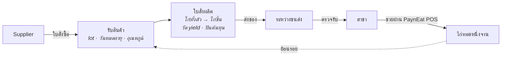

# PaynEat ERP

**ERP ฝั่งซัพพลายแบบ open source สำหรับเชนร้านอาหารที่คุมห่วงโซ่อุปทานเอง —
ตั้งแต่ ซัพพลายเออร์ → โรงงาน → สาขา → จานบนโต๊ะลูกค้า และย้อนรอยได้ทุก lot**

[English](./README.md) · **ภาษาไทย**

---

> **สถานะ: ช่วงออกแบบ** โมเดลโดเมนและสถาปัตยกรรมตัดสินใจแล้ว บันทึกไว้เป็น
> [ADR](docs/adr/README.md) ยังไม่มีโค้ดแอปพลิเคชัน กำลังสร้างแบบเปิดเผยทีละ issue บน GitHub
> README นี้บอกเฉพาะสิ่งที่จริง ณ วันนี้ และจะเพิ่มขึ้นเมื่อแต่ละส่วนใช้งานได้จริง

## นี่คืออะไร

เชนร้านอาหารขนาดใหญ่ไม่ได้แค่ขายอาหารหน้าเคาน์เตอร์ แต่ซื้อวัตถุดิบจาก ซัพพลายเออร์ หลายเจ้า แปรรูปในโรงงาน
ของตัวเอง (เช่น หั่นไก่ทั้งตัวเป็นชิ้นตามมาตรฐาน) ส่งไปสาขา แล้วจึงขายให้ลูกค้า PaynEat ERP ดูแลส่วนตรงกลางนี้:

| | |
|---|---|
| **จัดซื้อ** | ซัพพลายเออร์, ใบสั่งซื้อ, ใบรับสินค้าพร้อมการตรวจรับ, การส่งคืน |
| **ผลิต** | ใบสั่งผลิตที่เปลี่ยน lot วัตถุดิบเป็น lot ผลผลิต วัด yield จริง และปันต้นทุนลงผลิตภัณฑ์ร่วม |
| **กระจายสินค้า** | ใบขอเบิกของสาขา, ใบโอนผ่านสถานะระหว่างขนส่ง, ตรวจรับทั้งต้นทางและปลายทาง |
| **การใช้ที่สาขา** | ยอดขายจาก [PaynEat POS](https://github.com/SuruchBoss/PaynEat) ถูกแปลงเป็นการใช้ตามทฤษฎีผ่านสูตรที่มีเวอร์ชัน |
| **การควบคุม** | บัญชีเคลื่อนไหวสต๊อกแบบ append-only, ตรวจนับ, ปิดงวด, recall, การแยกหน้าที่ |
| **การวางแผน** | จุดสั่งซื้อ, ใบขอเบิกตาม par, คำแนะนำจาก MRP-lite |

## เส้นทางที่ release แรกต้องเดินได้ครบและแม่น

ทุกอย่างใน release แรกรับใช้เส้นทางเดียวแบบ end-to-end ผ่านเชนไก่ทอดสมมติ (1 โรงงาน 3 สาขา 2 ซัพพลายเออร์):

ลูกศรสุดท้ายคือหัวใจ: จากจานที่ขายไปที่สาขา แสดง lot ของ ซัพพลายเออร์ ทุก lot ที่เป็นไปได้ และบอกตรงๆ ว่าการ
ตัด lot ระดับสาขาเป็นการอนุมาน ไม่ได้มาจากการสแกน ([ADR-0006](docs/adr/0006-lots-expiry-and-traceability.th.md))

## การตัดสินใจเชิงออกแบบ

ใน ERP "ทำไม" สำคัญกว่า "ทำอะไร" ทุกการตัดสินใจจึงถูกเขียนไว้:

| ADR | การตัดสินใจ |
|---|---|
| [0001](docs/adr/0001-product-scope.th.md) | ขอบเขตผลิตภัณฑ์ และส่วนที่อยู่ที่อื่น (export ไปโปรแกรมบัญชี, HR และเงินเดือนอยู่ใน Cwork) |
| [0002](docs/adr/0002-system-boundaries-and-pos-integration.th.md) | แยกระบบ, ERP เป็นเจ้าของ master data, ยอดขายจาก POS ไหลผ่าน outbox พร้อม idempotency key |
| [0003](docs/adr/0003-append-only-stock-ledger.th.md) | สต๊อกเป็นบัญชีเคลื่อนไหวแบบ append-only จากเอกสารที่ post แล้วแก้ไม่ได้ |
| [0004](docs/adr/0004-lot-costing-and-cost-allocation.th.md) | ต้นทุนจริงราย lot, ตัดแบบ FEFO, ปันต้นทุนลงผลิตภัณฑ์ร่วม |
| [0005](docs/adr/0005-units-and-variable-weight-items.th.md) | หน่วยหลักหน่วยเดียวต่อรายการ, รายการน้ำหนักแปรผันบันทึกทั้งน้ำหนักและจำนวน |
| [0006](docs/adr/0006-lots-expiry-and-traceability.th.md) | ผังความสัมพันธ์ lot, บล็อกของหมดอายุ, recall ที่รายงาน lot ที่เป็นไปได้ |
| [0007](docs/adr/0007-receiving-inspection-and-transfers.th.md) | การตรวจรับโมเดลเดียว, โอนผ่านระหว่างขนส่ง, ไม่มีส่วนต่างที่หายไปเงียบๆ |
| [0008](docs/adr/0008-roles-and-segregation-of-duties.th.md) | 7 บทบาท, ไม่มีใครอนุมัติเอกสารที่ตัวเองสร้าง |
| [0009](docs/adr/0009-replenishment-planning-v1.th.md) | จุดสั่งซื้อ ใบขอเบิก และ MRP-lite — เป็นคำแนะนำ ไม่ใช่ระบบอัตโนมัติ |

| [0010](docs/adr/0010-backend-and-web-stack.th.md) | NestJS + Prisma + PostgreSQL, post บัญชีสต๊อกด้วย SQL ตรง, หน้าจอ React — แนวเดียวกับ Cwork |
| [0011](docs/adr/0011-ecosystem-and-sherwhyve.th.md) | ระบบนิเวศเดียวกับ POS, Cwork และ SherWhyve; ทุกระบบสืบสวนได้; ตัวสืบสวนส่วนต่างในอนาคต |

ศัพท์โดเมนภาษาอังกฤษ–ไทย: [`docs/GLOSSARY.md`](docs/GLOSSARY.md)

## ความสัมพันธ์กับโปรเจกต์คู่กัน

| โปรเจกต์ | เป็นเจ้าของ |
|---|---|
| **PaynEat ERP** (repo นี้) | รายการสินค้า สูตร ซัพพลายเออร์ สถานที่ สต๊อก lot ต้นทุน การวางแผน |
| [PaynEat POS](https://github.com/SuruchBoss/PaynEat) | ออเดอร์ การชำระเงิน กะ ใบกำกับภาษีที่สาขา — และยังใช้เดี่ยวได้โดยไม่ต้องมี ERP |
| [Cwork](https://github.com/SuruchBoss/Cwork) | บุคลากร เวลาทำงาน การลา เงินเดือน (มีแผนเชื่อมต่อ) |
| SherWhyve *(private)* | AI สืบสวนเหตุขัดข้องทางเทคนิค อ่าน log และ metric แบบมีโครงสร้างของ ERP เพื่ออธิบายพร้อมหลักฐานว่าอะไรพังเพราะอะไร |

ขอบเขตระหว่างกันอยู่ใน [ADR-0011](docs/adr/0011-ecosystem-and-sherwhyve.th.md): แต่ละระบบเป็นเจ้าของโดเมนเดียว เชื่อมกันผ่าน API และ event ที่มีเวอร์ชันเท่านั้น และสถานที่หนึ่งแห่งใช้รหัสเดียวกันในทุกระบบ

## Roadmap ของ release แรก (6 สัปดาห์)

1. สัญญาการเชื่อมต่อกับ POS และแกนโดเมน: รายการสินค้า หน่วยนับ สถานที่ lot บัญชีเคลื่อนไหว
2. ใบสั่งซื้อ ใบรับสินค้า ใบสั่งผลิต
3. ใบโอนและใบขอเบิก
4. ฝั่ง POS: outbox, โหมดเชื่อมต่อ ERP, master data แบบอ่านอย่างเดียว (ทำใน repo ของ POS)
5. การย้อนรอยและ recall, ตรวจนับ, ปิดงวด
6. คุณภาพ: เทสต์ ข้อมูล demo เอกสาร วิดีโอพาทัวร์

ติดตามความคืบหน้าได้ที่ [GitHub Issues](https://github.com/SuruchBoss/PaynEat-ERP/issues)

## ร่วมพัฒนา

issue ที่ติด label `ready-for-agent` เป็นงานที่ครบในตัวเอง หยิบไปทำได้ แต่ต้อง claim ก่อนเริ่ม
(ดูข้อตกลงการทำงานใน [`CLAUDE.md`](CLAUDE.md) ซึ่งใช้กับคนเท่ากับ AI agent)

## License

[Apache License 2.0](LICENSE) ถ้านำไปต่อยอด กรุณาคงไฟล์ [NOTICE](NOTICE) ไว้
