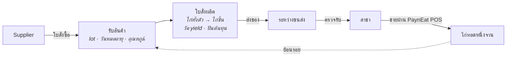

<div align="center">

<h1>
  <picture>
    <source media="(prefers-color-scheme: dark)" srcset="docs/brand/payneat-erp-logo-dark.svg">
    
  </picture>
</h1>

**ERP ฝั่งซัพพลายแบบ open source สำหรับเชนร้านอาหารที่คุมห่วงโซ่อุปทานเอง —
ตั้งแต่ ซัพพลายเออร์ → โรงงาน → สาขา → จานบนโต๊ะลูกค้า และย้อนรอยได้ทุก lot**

[English](./README.md) · **ภาษาไทย**

[](./LICENSE)


</div>

---

> **สถานะ: โครงระบบ (walking skeleton)** โมเดลโดเมนและสถาปัตยกรรมตัดสินใจแล้ว บันทึกไว้เป็น
> [ADR](docs/adr/README.md) backend รันได้แล้ว (health, log แบบมีโครงสร้าง และ metric) พร้อม web console
> ภาษาไทยและอังกฤษ ที่มีการเข้าสู่ระบบ (ผู้ดูแลระบบต้องยืนยันตัวตนขั้นที่สอง) ผู้ใช้ บทบาททั้งเจ็ด บันทึก
> การตรวจสอบ และข้อมูลหลักสินค้า: สินค้า หน่วยนับ หน่วยซื้อพร้อมตัวคูณแปลงหน่วยแบบแม่นยำ และบันทึกการเปลี่ยนแปลง
> master data แบบมีเวอร์ชันที่ POS จะดึงไปใช้ console ใช้ได้ทั้งคอมพิวเตอร์ แท็บเล็ต (เมนูย่อเหลือไอคอน) และมือถือ
> (ตารางเปลี่ยนเป็นการ์ดแถวละใบ) ทั้งโหมดสว่างและมืด ยังไม่มีเอกสารด้านสต๊อกหรือจัดซื้อ กำลังสร้างแบบเปิดเผยทีละ issue
> บน GitHub README นี้บอกเฉพาะสิ่งที่จริง ณ วันนี้ และจะเพิ่มขึ้นเมื่อแต่ละส่วนใช้งานได้จริง

## นี่คืออะไร

เชนร้านอาหารขนาดใหญ่ไม่ได้แค่ขายอาหารหน้าเคาน์เตอร์ แต่ซื้อวัตถุดิบจาก ซัพพลายเออร์ หลายเจ้า แปรรูปในโรงงาน
ของตัวเอง (เช่น หั่นไก่ทั้งตัวเป็นชิ้นตามมาตรฐาน) ส่งไปสาขา แล้วจึงขายให้ลูกค้า PaynEat ERP ดูแลส่วนตรงกลางนี้:

| | |
|---|---|
| **จัดซื้อ** | ซัพพลายเออร์, ใบสั่งซื้อ, ใบรับสินค้าพร้อมการตรวจรับ, การส่งคืน |
| **ผลิต** | ใบสั่งผลิตที่เปลี่ยน lot วัตถุดิบเป็น lot ผลผลิต วัด yield จริง และปันต้นทุนลงผลิตภัณฑ์ร่วม |
| **กระจายสินค้า** | ใบขอเบิกของสาขา, ใบโอนผ่านสถานะระหว่างขนส่ง, ตรวจรับทั้งต้นทางและปลายทาง |
| **การใช้ที่สาขา** | ยอดขายจาก [PaynEat POS](https://github.com/SuruchBoss/PaynEat) ถูกแปลงเป็นการใช้ตามทฤษฎีผ่านสูตรที่มีเวอร์ชัน |
| **การควบคุม** | บัญชีเคลื่อนไหวสต๊อกแบบ append-only, ตรวจนับ, ปิดงวด, recall, การแยกหน้าที่ |
| **การวางแผน** | จุดสั่งซื้อ, ใบขอเบิกตาม par, คำแนะนำจาก MRP-lite |

## เส้นทางที่ release แรกต้องเดินได้ครบและแม่น

ทุกอย่างใน release แรกรับใช้เส้นทางเดียวแบบ end-to-end ผ่านเชนไก่ทอดสมมติ (1 โรงงาน 3 สาขา 2 ซัพพลายเออร์):



ลูกศรสุดท้ายคือหัวใจ: จากจานที่ขายไปที่สาขา แสดง lot ของ ซัพพลายเออร์ ทุก lot ที่เป็นไปได้ และบอกตรงๆ ว่าการ
ตัด lot ระดับสาขาเป็นการอนุมาน ไม่ได้มาจากการสแกน ([ADR-0006](docs/adr/0006-lots-expiry-and-traceability.th.md))

## การตัดสินใจเชิงออกแบบ

ใน ERP "ทำไม" สำคัญกว่า "ทำอะไร" ทุกการตัดสินใจจึงถูกเขียนไว้:

| ADR | การตัดสินใจ |
|---|---|
| [0001](docs/adr/0001-product-scope.th.md) | ขอบเขตผลิตภัณฑ์ และส่วนที่อยู่ที่อื่น (export ไปโปรแกรมบัญชี, HR และเงินเดือนอยู่ใน Cwork) |
| [0002](docs/adr/0002-system-boundaries-and-pos-integration.th.md) | แยกระบบ, ERP เป็นเจ้าของ master data, ยอดขายจาก POS ไหลผ่าน outbox พร้อม idempotency key |
| [0003](docs/adr/0003-append-only-stock-ledger.th.md) | สต๊อกเป็นบัญชีเคลื่อนไหวแบบ append-only จากเอกสารที่ post แล้วแก้ไม่ได้ |
| [0004](docs/adr/0004-lot-costing-and-cost-allocation.th.md) | ต้นทุนจริงราย lot, ตัดแบบ FEFO, ปันต้นทุนลงผลิตภัณฑ์ร่วม |
| [0005](docs/adr/0005-units-and-variable-weight-items.th.md) | หน่วยหลักหน่วยเดียวต่อรายการ, รายการน้ำหนักแปรผันบันทึกทั้งน้ำหนักและจำนวน |
| [0006](docs/adr/0006-lots-expiry-and-traceability.th.md) | ผังความสัมพันธ์ lot, บล็อกของหมดอายุ, recall ที่รายงาน lot ที่เป็นไปได้ |
| [0007](docs/adr/0007-receiving-inspection-and-transfers.th.md) | การตรวจรับโมเดลเดียว, โอนผ่านระหว่างขนส่ง, ไม่มีส่วนต่างที่หายไปเงียบๆ |
| [0008](docs/adr/0008-roles-and-segregation-of-duties.th.md) | 7 บทบาท, ไม่มีใครอนุมัติเอกสารที่ตัวเองสร้าง |
| [0009](docs/adr/0009-replenishment-planning-v1.th.md) | จุดสั่งซื้อ ใบขอเบิก และ MRP-lite — เป็นคำแนะนำ ไม่ใช่ระบบอัตโนมัติ |
| [0010](docs/adr/0010-backend-and-web-stack.th.md) | NestJS + Prisma + PostgreSQL, post บัญชีสต๊อกด้วย SQL ตรง, หน้าจอ React — แนวเดียวกับ Cwork |
| [0011](docs/adr/0011-ecosystem-and-sherwhyve.th.md) | ระบบนิเวศเดียวกับ POS, Cwork และ SherWhyve; ทุกระบบสืบสวนได้; ตัวสืบสวนส่วนต่างในอนาคต |
| [0012](docs/adr/0012-positioning-niche-depth-over-breadth.th.md) | จุดยืน: ตัวเลือก open source ที่ดีที่สุดสำหรับเชนร้านอาหารไทยที่คุมห่วงโซ่อุปทานเอง — ลึกในสนามเดียว ไม่ใช่ ERP ครอบจักรวาล; เชื่อมกับโปรแกรมบัญชีที่มีอยู่แทนการแทนที่ |
| [0013](docs/adr/0013-extension-by-integration.th.md) | ต่อยอดผ่านการเชื่อมต่อ: public API ที่มีเวอร์ชัน, token จำกัดสิทธิ์ และ webhook ที่มีลายเซ็น — ไม่มี plugin ที่รันภายในแล้วข้ามกฎบัญชีสต๊อกได้ |
| [0014](docs/adr/0014-lot-expiry-never-later-than-supplier-date.th.md) | วันหมดอายุของ lot คือวันที่เร็วกว่าระหว่างอายุการเก็บกับวันที่ของซัพพลายเออร์; ผลผลิตหมดอายุไม่ช้ากว่าวัตถุดิบ |
| [0015](docs/adr/0015-editions-community-and-enterprise.th.md) | สองรุ่น: Community ฟรีและครบสำหรับหนึ่งเชน กับ Enterprise แบบเสียเงินสำหรับขนาดใหญ่ กฎระเบียบ และ AI; ความปลอดภัยอาหาร การเข้าถึงข้อมูล และการอัปเกรด ไม่มีวันอยู่หลัง paywall |
| [0016](docs/adr/0016-exceltogo-spreadsheet-companion.th.md) | ExcelToGo เข้าร่วมเป็นเครื่องมือสเปรดชีต: ย้ายข้อมูลด้วยไฟล์แม่แบบ และรายงานบัญชีผ่าน public API |
| [0017](docs/adr/0017-stock-counts.th.md) | ตรวจนับแบบไม่เห็นยอดและเทียบ ณ เวลาตรวจนับ; โรงงานนับราย lot สาขานับรายสินค้า และส่วนต่างที่สาขาปันลง lot ด้วยกฎที่คำนวณตามด้วยมือได้ |
| [0018](docs/adr/0018-period-close-and-business-time.th.md) | ปิดงวดรายสถานที่ตามวันที่เกิดรายการ; ยอดขายที่มาหลังงวดปิดยัง post ได้ในวันแรกที่เปิดอยู่พร้อมเครื่องหมายว่ามาช้า; การเปิดงวดใหม่มีบันทึกตรวจสอบ และ export ซ้ำเป็นฉบับแก้ไข |
| [0019](docs/adr/0019-exact-quantities-and-conversion-rounding.th.md) | ปริมาณและตัวคูณเป็นทศนิยมแบบแม่นยำ ไม่ใช่ floating point; ตัวคูณต้องมากกว่าศูนย์เสมอ; การแปลงเป็นหน่วยหลักปัดเศษครั้งเดียวแบบครึ่งหนึ่งปัดออกจากศูนย์ตามทศนิยมของหน่วยนั้น; หน่วยหลักของสินค้าเปลี่ยนไม่ได้ |

ศัพท์โดเมนภาษาอังกฤษ–ไทย: [`docs/GLOSSARY.md`](docs/GLOSSARY.md)

## ความสัมพันธ์กับโปรเจกต์คู่กัน

| โปรเจกต์ | เป็นเจ้าของ |
|---|---|
| **PaynEat ERP** (repo นี้) | รายการสินค้า สูตร ซัพพลายเออร์ สถานที่ สต๊อก lot ต้นทุน การวางแผน |
| [PaynEat POS](https://github.com/SuruchBoss/PaynEat) | ออเดอร์ การชำระเงิน กะ ใบกำกับภาษีที่สาขา — และยังใช้เดี่ยวได้โดยไม่ต้องมี ERP |
| [Cwork](https://github.com/SuruchBoss/Cwork) | บุคลากร เวลาทำงาน การลา เงินเดือน (มีแผนเชื่อมต่อ) |
| SherWhyve *(private)* | AI สืบสวนเหตุขัดข้องทางเทคนิค อ่าน log และ metric แบบมีโครงสร้างของ ERP เพื่ออธิบายพร้อมหลักฐานว่าอะไรพังเพราะอะไร |
| [ExcelToGo](https://github.com/SuruchBoss/ExcelToGo) | สเปรดชีต: กรอกแม่แบบนำเข้าของ ERP และรายงานบัญชีที่ดึงจาก public API ของ ERP (มีแผนเชื่อมต่อ, ADR-0016) |

ขอบเขตระหว่างกันอยู่ใน [ADR-0011](docs/adr/0011-ecosystem-and-sherwhyve.th.md): แต่ละระบบเป็นเจ้าของโดเมนเดียว เชื่อมกันผ่าน API และ event ที่มีเวอร์ชันเท่านั้น และสถานที่หนึ่งแห่งใช้รหัสเดียวกันในทุกระบบ

## Roadmap ของ release แรก (6 สัปดาห์)

1. สัญญาการเชื่อมต่อกับ POS และแกนโดเมน: รายการสินค้า หน่วยนับ สถานที่ lot บัญชีเคลื่อนไหว
2. ใบสั่งซื้อ ใบรับสินค้า ใบสั่งผลิต
3. ใบโอนและใบขอเบิก
4. ฝั่ง POS: outbox, โหมดเชื่อมต่อ ERP, master data แบบอ่านอย่างเดียว (ทำใน repo ของ POS)
5. การย้อนรอยและ recall, ตรวจนับ, ปิดงวด
6. คุณภาพ: เทสต์ ข้อมูล demo เอกสาร วิดีโอพาทัวร์

หลัง release แรก: public API ที่มีเวอร์ชัน, API token แบบจำกัดสิทธิ์ และ webhook ขาออก เพื่อให้เชนสร้างส่วนเสริม
ของตัวเองเป็นบริการแยกได้ ([ADR-0013](docs/adr/0013-extension-by-integration.th.md))

ติดตามความคืบหน้าได้ที่ [GitHub Issues](https://github.com/SuruchBoss/PaynEat-ERP/issues)

## รุ่นของระบบ

| | Community | Enterprise |
|---|---|---|
| ราคา | ฟรี | เสียเงิน คิดต่อสถานที่ที่ใช้งานต่อเดือน (ไม่คิดต่อผู้ใช้) |
| License | Apache 2.0 | Elastic License 2.0 (อ่านโค้ดได้ใน `ee/`) |
| มีอะไร | ทุกอย่างใน release แรก และทุกการพัฒนาต่อในเส้นทางซัพพลายเออร์ถึงจาน ไม่จำกัดผู้ใช้ สถานที่ หรือข้อมูล | ความต้องการที่โตตามขนาด กฎระเบียบ หรือต้นทุนการรัน: หลายบริษัทและหลายโรงงาน, โปรแกรมความปลอดภัยอาหาร (HACCP, เซนเซอร์, ซ้อม recall), สแกนแพ็ก, การเงินเชิงลึก, แอปมือถือ, ตัวเชื่อมโปรแกรมบัญชี, AI agent, single sign-on |
| สถานะ | กำลังสร้าง | เริ่มหลัง release แรก ร่วมกับเชนนำร่อง |

**ไม่มีวันอยู่หลัง paywall:** ความปลอดภัยอาหารและความถูกต้องของข้อมูล (บล็อกของหมดอายุ, ย้อนรอย recall,
บัญชีสต๊อก, การแยกหน้าที่, audit trail), ความปลอดภัยพื้นฐาน, สิทธิ์เข้าถึงข้อมูลของตัวเองทั้งหมด และเส้นทางอัปเกรดที่มี
เอกสาร ฟีเจอร์ของ Community จะไม่ถูกย้ายไป Enterprise ส่วน hosting, บริการอัปเกรดให้, support และการติดตั้งวาง
ระบบ เป็นบริการเสียเงินที่ใช้ได้กับทั้งสองรุ่น รายละเอียด: [ADR-0015](docs/adr/0015-editions-community-and-enterprise.th.md)

## ลองรัน

สิ่งที่ใช้ได้วันนี้: การเข้าสู่ระบบ โดยผู้ดูแลระบบต้องยืนยันตัวตนขั้นที่สอง ผู้ใช้และบทบาททั้งเจ็ดตาม
[ADR-0008](docs/adr/0008-roles-and-segregation-of-duties.th.md) บันทึกการตรวจสอบที่แก้ย้อนหลังไม่ได้
**ข้อมูลหลักสินค้า** ได้แก่ สินค้า หน่วยนับ และหน่วยซื้อ ซึ่งทุกการเปลี่ยนแปลงได้เวอร์ชัน master data ใหม่ให้ POS
ดึงไปใช้ และโครงระบบข้างใต้ ได้แก่ API ที่รายงานสถานะของตัวเองและของฐานข้อมูล เขียนทุก request เป็น JSON แบบมีโครงสร้าง
(ตาม[สัญญา telemetry](docs/TELEMETRY.md) ของระบบนิเวศ) และนับ request กับการเข้าสู่ระบบที่ถูกปฏิเสธเป็น
metric ของ Prometheus ต้องมี [Docker](https://docs.docker.com/get-docker/) และ `openssl` สำหรับขั้นแรก

```bash
# ความลับสามค่าของคุณเอง compose จะไม่ยอมเริ่มถ้าไม่มี (ดู .env.example)
printf 'JWT_ACCESS_SECRET=%s\nJWT_REFRESH_SECRET=%s\nFIELD_ENCRYPTION_KEY=%s\n' \
  "$(openssl rand -base64 48)" "$(openssl rand -base64 48)" "$(openssl rand -base64 32)" > .env
# ตั้งใจ: นี่คือการทดลองกับเชนเดโม ซึ่งรหัสผ่านเผยแพร่อยู่แล้ว
echo 'ERP_DEMO=1' >> .env

docker compose up -d --build                        # PostgreSQL 16, API และ web console
docker compose run --rm --build migrate             # สร้างตารางในฐานข้อมูล
docker compose run --rm migrate npm run db:seed     # เชนสมมติ: ตัวบริษัท ผู้ใช้บทบาทละหนึ่งคน และสินค้า
curl http://localhost:3100/health                   # {"status":"ok","api":"up","database":"up"}
docker compose logs api                             # JSON บรรทัดละ object
```

แล้วเปิด **http://localhost:8180** และเข้าสู่ระบบด้วยบัญชีเดโมด้านล่าง console เปิดเป็นภาษาไทย กด
**English** มุมขวาบนเพื่อสลับภาษา แล้วเบราว์เซอร์จะจำไว้

### ระบบเดโมต้องตั้งใจเปิดเท่านั้น (`ERP_DEMO=1`)

รหัสผ่านของบัญชีเดโมอยู่ใน README นี้ จึงใช้ได้เฉพาะที่ที่คุณสั่งให้ใช้ได้เท่านั้น:

- **seed ไม่ยอมรัน** ถ้าไม่มี `ERP_DEMO=1` และไม่รันเลยเมื่อ `NODE_ENV=production`
- **API ปฏิเสธการเข้าสู่ระบบของบัญชีเดโม** ถ้าไม่มี `ERP_DEMO=1` (นับเป็นการเข้าสู่ระบบที่ถูกปฏิเสธเหมือนกรณีอื่น)
  และตัด session ที่บัญชีเดโมถืออยู่แล้วด้วย
- **API ที่รันแบบ production ไม่ยอมเริ่มทำงาน** ถ้ายังมีบัญชีเดโมที่เปิดใช้งานอยู่และไม่ได้ตั้ง `ERP_DEMO=1` บรรทัด
  log สุดท้ายเป็นระดับ `CRITICAL` ที่บอกวิธีแก้ในบรรทัดเดียว: ปิดบัญชีเดโมด้วย
  `docker compose run --rm migrate npm run demo:disable` (ผู้ใช้ไม่ถูกลบ แค่ปิดใช้งาน) หรือตั้ง `ERP_DEMO=1`
  ถ้านี่เป็นการทดลองจริงๆ การรัน seed อีกครั้งจะเปิดบัญชีเดโมกลับมา
- **เมื่อตั้ง `ERP_DEMO=1`** API เขียนบรรทัด `WARNING` ทุกครั้งที่เริ่ม และทุกหน้าของ console รวมถึงหน้าเข้าสู่ระบบ
  มีแถบ **ระบบเดโม** ที่ปิดไม่ได้

บัญชีเดโมคือบัญชีที่ seed ทำเครื่องหมายไว้ ไม่ได้ดูจากอีเมล ใน `.env.example` บรรทัดนี้ถูกคอมเมนต์ไว้ การติดตั้งจริง
ไม่ต้องตั้งค่านี้

### บัญชีเดโม

> **สำหรับทดลองเท่านั้น** ทุกข้อมูลเข้าสู่ระบบในส่วนนี้เผยแพร่อยู่ใน repository นี้ และถูกตั้งค่ากลับทุกครั้งที่รัน
> seed ห้ามใช้บัญชีเหล่านี้หรือ seed กับการติดตั้งจริง

รหัสผ่านของบัญชีเดโมทุกบัญชีคือ **`demo-chicken-2026`**

| บทบาท | อีเมล | บทบาทนี้มีไว้ทำอะไร (ADR-0008) | ทำอะไรใน console ได้วันนี้ |
|---|---|---|---|
| `admin` | `admin@demo-chicken.example` | จัดการผู้ใช้ บทบาท สถานที่เก็บสต๊อก การตั้งค่า; เปิดงวดที่ปิดแล้วอีกครั้ง | เข้าสู่ระบบด้วยการยืนยันตัวตนขั้นที่สอง; หน้า **ผู้ใช้และบทบาท**: ดูรายชื่อ เพิ่มผู้ใช้ ให้และถอนบทบาท; หน้า **สินค้าและหน่วยนับ**: เพิ่ม แก้ไข ปิดใช้งาน; อ่านบันทึกการตรวจสอบ (ผ่าน API) |
| `purchasing` | `purchasing@demo-chicken.example` | สร้างและส่งใบสั่งซื้อ; จัดการซัพพลายเออร์ | เข้าสู่ระบบได้; ดู **สินค้าและหน่วยนับ**; หน้าจอของบทบาทนี้มากับ #6 และ #10 |
| `purchasing_approver` | `approver@demo-chicken.example` | อนุมัติใบสั่งซื้อที่เกินเกณฑ์วงเงินที่ต้องอนุมัติ | เข้าสู่ระบบได้; ดู **สินค้าและหน่วยนับ**; หน้าจอมากับ #10 |
| `plant` | `plant@demo-chicken.example` | รับสินค้า ดำเนินการใบสั่งผลิต จัดการสต๊อกของโรงงาน | เข้าสู่ระบบได้; ดู **สินค้าและหน่วยนับ**; หน้าจอมากับ #11 และ #13 |
| `logistics` | `logistics@demo-chicken.example` | ส่งของตามใบโอน | เข้าสู่ระบบได้; ดู **สินค้าและหน่วยนับ**; หน้าจอมากับ #14 |
| `branch_manager` | `branch.manager@demo-chicken.example` | ออกใบขอเบิก รับโอน ตรวจนับสต๊อกสาขา | เข้าสู่ระบบได้; ดู **สินค้าและหน่วยนับ**; หน้าจอมากับ #14 และ #15 |
| `finance` | `finance@demo-chicken.example` | ดูต้นทุน ส่วนต่าง และมูลค่าสต๊อก; export ข้อมูลทางการเงิน | เข้าสู่ระบบได้; ดู **สินค้าและหน่วยนับ**; หน้าจอมากับงานต้นทุนและการปิดงวดในสัปดาห์ที่ 4–5 |

ผู้ใช้หนึ่งคนถือได้หลายบทบาท API ปฏิเสธทุกอย่างที่ไม่มีบทบาทใดอนุญาต (403) และทุกอย่างที่ไม่มี session (401)
ไม่มีใครอนุมัติเอกสารที่ตัวเองสร้างได้ ไม่ว่าจะถือบทบาทใด ข้อนี้เริ่มตรวจเมื่อมีการอนุมัติครั้งแรก (#8, #10)

**บัญชี admin ต้องยืนยันตัวตนขั้นที่สอง** เพิ่มรหัสลับเดโมที่เผยแพร่ไว้ลงในแอปยืนยันตัวตนใดก็ได้ (Google
Authenticator, Microsoft Authenticator, 1Password ฯลฯ) แล้วพิมพ์รหัส 6 หลักที่แอปแสดง:

- รหัสลับ **`PAYNEATERPDEMOTWOFACTORSECRET234`** หรือสร้างคิวอาร์โค้ดจาก URI นี้:
  `otpauth://totp/PaynEat%20ERP%3Aadmin%40demo-chicken.example?secret=PAYNEATERPDEMOTWOFACTORSECRET234&issuer=PaynEat%20ERP&algorithm=SHA1&digits=6&period=30`
- ไม่มีแอปอยู่ใกล้มือ? ใช้รหัสกู้คืนเหล่านี้แทนรหัสจากแอปได้ รหัสละครั้ง (seed ตั้งค่ากลับให้):
  `DEMOC-HICKE-NRCVR-YAAA2`, `DEMOC-HICKE-NRCVR-YBBB3`, `DEMOC-HICKE-NRCVR-YCCC4`,
  `DEMOC-HICKE-NRCVR-YDDD5`, `DEMOC-HICKE-NRCVR-YEEE6`

### ทัวร์ 5 นาที

1. เข้าสู่ระบบเป็น **admin**: รหัสผ่าน แล้วรหัสยืนยัน ใส่รหัสยืนยันผิดนับเหมือนใส่รหัสผ่านผิด ผิดติดกัน 5 ครั้ง
   บัญชีจะถูกล็อก 15 นาที
2. เปิด **ผู้ใช้และบทบาท** กด **เพิ่มผู้ใช้** ใส่ชื่อ อีเมล รหัสผ่านเริ่มต้น (อย่างน้อย 12 ตัวอักษร) และติ๊ก
   **ผู้ดูแลระบบ**
3. **ออกจากระบบ** แล้วเข้าสู่ระบบเป็นผู้ใช้ใหม่นั้น ผู้ดูแลระบบที่ยังไม่มีการยืนยันตัวตนขั้นที่สองต้องตั้งค่าก่อนทำ
   อย่างอื่น: สแกนคิวอาร์โค้ด พิมพ์รหัส แล้วเก็บรหัสกู้คืนที่ console แสดงครั้งเดียว
4. กลับมาเป็น **admin** กด **จัดการบทบาท** ของผู้ใช้คนไหนก็ได้ ติ๊กคือให้บทบาท เอาติ๊กออกคือถอน มีผลกับ
   คำขอถัดไปของผู้ใช้คนนั้น ลองถอน **ผู้ดูแลระบบ** จากผู้ใช้ที่เพิ่งสร้าง แล้วถอนจากตัวเอง: ผู้ดูแลระบบคนสุดท้าย
   ที่ใช้งานอยู่จะยังถือบทบาทนี้ต่อ และ console บอกเหตุผล
5. เข้าสู่ระบบเป็น **purchasing**: เมนูไม่มี **ผู้ใช้และบทบาท** และถ้าเปิด `/users` ตรงๆ จะขึ้นว่าไม่มีสิทธิ์
   แต่มี **สินค้าและหน่วยนับ** ให้ดูอย่างเดียว: ไก่ทั้งตัวนับเป็นกิโลกรัม (น้ำหนักแปรผัน ซื้อเป็นลัง
   `1 ลัง = 20 กิโลกรัม`) ชิ้นส่วนสี่แบบนับเป็นชิ้น โครงไก่เป็นกิโลกรัม แป้งชุบทอด น้ำมันทอด และผงปรุงรส
6. กลับมาเป็น **admin** เปิด **สินค้าและหน่วยนับ** แล้วกด **เพิ่มสินค้า**: ใส่รหัส (พิมพ์ตัวเล็กก็ได้ ระบบเก็บเป็น
   ตัวใหญ่) ชื่อไทยและอังกฤษ หน่วยหลัก อายุการเก็บ และหน่วยซื้อ เช่น **ถุง** ละ `25` กิโลกรัม ฟอร์มจะแสดงตัวอย่าง
   `1 ถุง = 25 กิโลกรัม` ลองใส่ตัวคูณเป็น `0` หรือ `-5` หรือใช้หน่วยหลักเป็นหน่วยซื้อ: API ปฏิเสธ และบอกเหตุผล
   ทีละแถว กด **แก้ไข** สินค้า: รหัสและหน่วยหลักเปลี่ยนไม่ได้ (ADR-0019) กด **ปิดใช้งาน**: สินค้าหายจากรายการ
   ปกติแต่ไม่ถูกลบ เลือก **แสดง: ทั้งหมด** เพื่อเห็นและเปิดใช้งานอีกครั้ง
7. ทุกการเปลี่ยนแปลงสินค้าได้ **เวอร์ชัน master data** ใหม่ ซึ่งเป็นตัวเลขที่ POS ใช้ดึงข้อมูล อ่านบันทึกด้วย access
   token ของผู้ใช้คนไหนก็ได้: `GET /api/v1/master-data/changes?since=0` ส่งทุกการเปลี่ยนแปลงเรียงตามเวอร์ชัน
   พร้อมข้อมูลสินค้าทั้งตัวหลังเปลี่ยน และ `latestVersion` ถามใหม่โดยตั้ง `since` เป็นเวอร์ชันล่าสุดที่เห็น จะได้
   เฉพาะที่ใหม่กว่า ผู้ดูแลสองคนกดบันทึกพร้อมกันก็ยังได้เวอร์ชันต่อเนื่องกัน และคนที่บันทึกจากหน้าจอที่ข้อมูลเก่า
   จะถูกบอกให้โหลดใหม่ ไม่ใช่เขียนทับของอีกคนโดยไม่รู้ตัว
8. ทุกการเปลี่ยนแปลงข้างบน และทุกการเข้าสู่ระบบที่ถูกปฏิเสธ อยู่ในบันทึกการตรวจสอบ พร้อมผู้กระทำ เวลา และรหัส
   อ้างอิง (correlation ID) ของคำขอ อ่านผ่าน API ด้วย access token ของ admin: `GET /api/v1/audit-logs`
   (กรองด้วย `action`, `entityId`, `actorUserId`, `correlationId`, `from`, `to`) การเข้าสู่ระบบที่ถูกปฏิเสธยัง
   เป็นบรรทัด `WARNING` ที่มี `"event":"auth.sign_in.failed"` ใน `docker compose logs api` (ไม่มีอีเมล
   รหัสผ่าน หรือรหัสยืนยันเด็ดขาด) และนับเพิ่มใน metric `auth_sign_in_failures_total`

หน้า **สถานะระบบ** (หน้าแรก) ถาม API ว่าตัวมันและฐานข้อมูลทำงานปกติไหม ลองหยุดฐานข้อมูล
(`docker compose stop postgres`) แล้วกด **ตรวจอีกครั้ง** ฐานข้อมูลจะขึ้นว่าขัดข้อง พร้อม **รหัสอ้างอิง
(correlation ID)** ของการตรวจครั้งนั้น ซึ่งเป็นรหัสเดียวกับในบรรทัด log ของ API
(`docker compose logs api | grep <รหัส>`)

console อยู่ที่พอร์ต **8180** และ API อยู่ที่ **3100** เพื่อให้รันคู่กับ PaynEat POS ได้ (Docker ของ POS
ใช้ 3000 และ 8080) ส่วน metric เปิดที่พอร์ต 9464 ภายในเครือข่ายของ compose และตั้งใจไม่เปิดออกข้างนอก
`docker compose down -v` ลบทุกอย่างรวมข้อมูล

ถ้าจะพัฒนา backend เอง (ต้องมี Node.js 22 และ PostgreSQL 16 ที่เชื่อมต่อได้):

```bash
cd backend
cp .env.example .env        # แล้วแก้ DATABASE_URL และ E2E_DATABASE_URL ให้ชี้ไปที่ PostgreSQL ของคุณ
                            # ตั้ง FIELD_ENCRYPTION_KEY (openssl rand -base64 32) และเอาคอมเมนต์
                            # ERP_DEMO=1 ออกถ้าจะใช้เชนเดโม
npm ci
npx prisma migrate deploy && npm run db:seed
npm run start:dev           # http://localhost:3000/health
```

และ console (Node.js 22) ซึ่งส่งต่อ `/api` กับ `/health` ไปที่ backend ตัวนั้น:

```bash
cd web
npm ci
npm run dev                 # http://localhost:5173 (เปลี่ยนที่อยู่ backend ด้วย VITE_API_PROXY_TARGET)
```

การตรวจทุกอย่างที่ CI รันอยู่ในหัวข้อ Stack ของ [`CLAUDE.md`](CLAUDE.md#stack)

## ร่วมพัฒนา

issue ที่ติด label `ready-for-agent` เป็นงานที่ครบในตัวเอง หยิบไปทำได้ แต่ต้อง claim ก่อนเริ่ม
(ดูข้อตกลงการทำงานใน [`CLAUDE.md`](CLAUDE.md) ซึ่งใช้กับคนเท่ากับ AI agent)

## License

Copyright 2026 Suruch Chakrapeesirisuk ทุกอย่างนอก `ee/` ใช้ [Apache License 2.0](LICENSE) ส่วนไดเรกทอรี
`ee/` ใช้ [Elastic License 2.0](ee/LICENSE) และยังไม่มีโค้ดใน v1 (ADR-0015) ทุกไฟล์ซอร์สระบุ license ด้วย SPDX
identifier ซึ่ง CI ตรวจ pull request จาก fork ต้อง sign off ตาม Developer Certificate of Origin ดู
[CONTRIBUTING.md](CONTRIBUTING.md) ถ้านำไปต่อยอด กรุณาคงไฟล์ [NOTICE](NOTICE) ไว้
